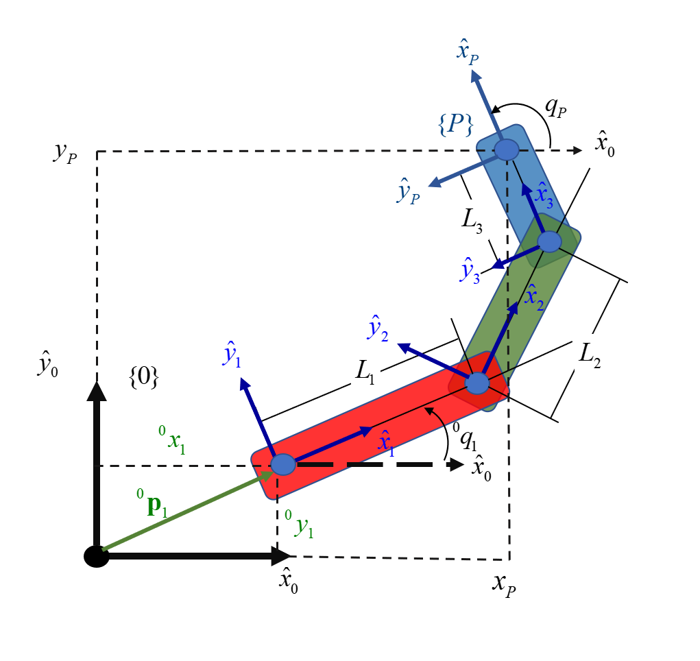
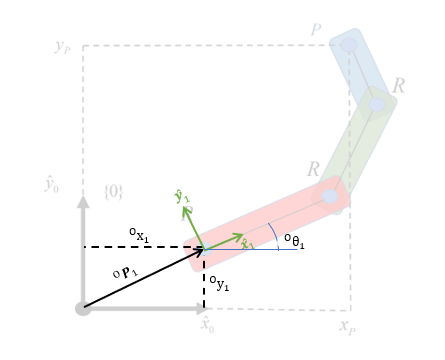
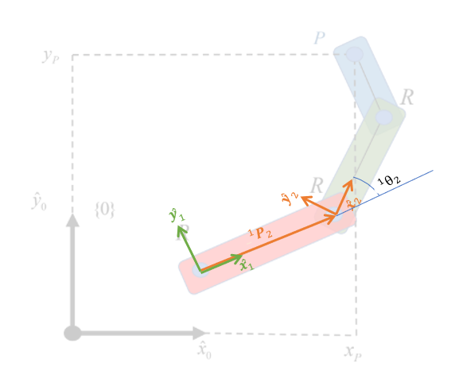
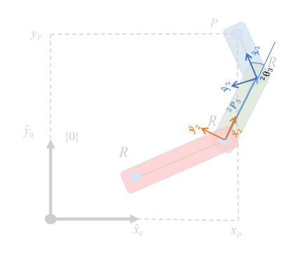
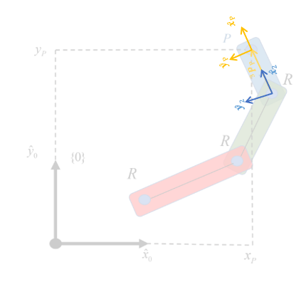
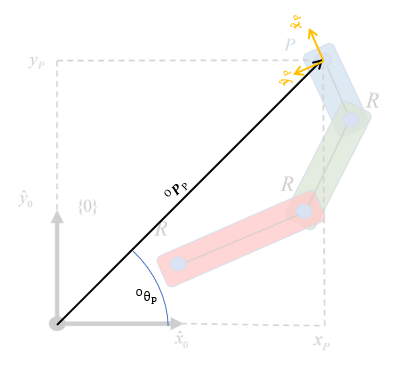
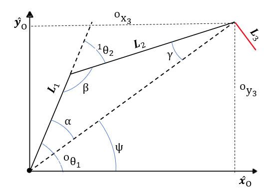

# Examen de robótica
# Introducción

A lo largo del curso se ha mencionado una gran cantidad de veces la palabra robot, se nos ha solicitado realizar una investigaciónes, tanto para entender el concepto de robor como para entendeer conceptos matemáticos que usaríamos más tarde para la comprención del funcionamiento de uno. Y hemos estudiado durante varias clases el enfoque que se le debe de dar al modelado de un robot. Pero, si ya se nos ha explicado el funcionamiento de este, la base teórica para poder modelar un robot, e incluso se ha hecho en clase la readcción de este documento tal que ya esté casi todo el planteamiento matemático plasmado aquí, ¿Por qué es necesario complementar el código que describe el procedimiento para modelar un robot RRR con un reporte?. De acuerdo a mi experiencia realizando el reporte puedo afirmar que este es un reporte realizado por y para nosotros, hecho para un entendimiento más profundo y detallado de lo que hay detrás del procedimiento para caracterizar a un robot, para quitarnos la costumbre de mecanizar el proceso y entender verdaderamente el análisis detrás de cada una de las ecuaciones presentadas, una oportunidad de poner a prueba el conocimiento adquirido en clase para poder transmitir la información de una forma sencilla y clara.


A lo largo de este documento se encuentra el desarrollo completo para el modelado de un robot scara de tres eslabones, contando con el modelado cinemático de la posición, la velocidad y la celeración, todos en su forma directa e inversaa y el modelado dinámico directo e inverso. en cada uno de los apartados se encuentran as ecuaciones utilizadas, así como una breve explicación de cada uno de los componentes de estas así como comentarios a lo largo de cada modelo, en el cual se realizaron notas de las observaciones encontradas en cada uno de estos. Como complemento se agregaron algunos diagramas en los apartados en lo que hacían falta para como un recurso de apoyo para una mejor comprensión del procedimiento

## Definición de funciones
```matlab
%Deficición de la función de manera simbolica
syms Tij(x_i_j,y_i_j,z_i_j,gi_j,bi_j,ai_j)

%Definición de la transformación homógenea general
Tij(x_i_j,y_i_j,z_i_j,gi_j,bi_j,ai_j) = [cos(ai_j)*cos(bi_j) cos(ai_j)*sin(bi_j)*sin(gi_j)-sin(ai_j)*cos(gi_j) sin(ai_j)*sin(gi_j)+cos(ai_j)*sin(bi_j)*cos(gi_j) x_i_j; sin(ai_j)*cos(bi_j) cos(ai_j)*cos(gi_j)+sin(ai_j)*sin(bi_j)*sin(gi_j) sin(ai_j)*sin(bi_j)*cos(gi_j)-cos(ai_j)*sin(gi_j) y_i_j; -sin(bi_j) cos(bi_j)*sin(gi_j) cos(bi_j)*cos(gi_j) z_i_j; 0 0 0 1]
```
Tij(x_i_j, y_i_j, z_i_j, gi_j, bi_j, ai_j) = 

  $$ \displaystyle \left(\begin{array}{cccc} \cos \left({\textrm{ai}}_j \right)\,\cos \left({\textrm{bi}}_j \right) & \cos \left({\textrm{ai}}_j \right)\,\sin \left({\textrm{bi}}_j \right)\,\sin \left({\textrm{gi}}_j \right)-\cos \left({\textrm{gi}}_j \right)\,\sin \left({\textrm{ai}}_j \right) & \sin \left({\textrm{ai}}_j \right)\,\sin \left({\textrm{gi}}_j \right)+\cos \left({\textrm{ai}}_j \right)\,\cos \left({\textrm{gi}}_j \right)\,\sin \left({\textrm{bi}}_j \right) & x_{i,j} \newline \cos \left({\textrm{bi}}_j \right)\,\sin \left({\textrm{ai}}_j \right) & \cos \left({\textrm{ai}}_j \right)\,\cos \left({\textrm{gi}}_j \right)+\sin \left({\textrm{ai}}_j \right)\,\sin \left({\textrm{bi}}_j \right)\,\sin \left({\textrm{gi}}_j \right) & \cos \left({\textrm{gi}}_j \right)\,\sin \left({\textrm{ai}}_j \right)\,\sin \left({\textrm{bi}}_j \right)-\cos \left({\textrm{ai}}_j \right)\,\sin \left({\textrm{gi}}_j \right) & y_{i,j} \newline -\sin \left({\textrm{bi}}_j \right) & \cos \left({\textrm{bi}}_j \right)\,\sin \left({\textrm{gi}}_j \right) & \cos \left({\textrm{bi}}_j \right)\,\cos \left({\textrm{gi}}_j \right) & z_{i,j} \newline 0 & 0 & 0 & 1 \end{array}\right) $$ 
 

# Modelado del robot Scara



## Planteamiento del modelo cinemático de la posición

Para el modelar la posición del sistema es necesario calcular la transformación homogénea total de este, la cual se calcula de la siguiente forma:

 $$ ^O {\mathbf{T}}_P =^O {\mathbf{T}}_1 \,^1 {\mathbf{T}}_2 \,^2 {\mathbf{T}}_3 \,^3 {\mathbf{T}}_P $$ 

Cómo se puede observar, para el calculo de la transformación es necesario obtener antes las trasnformaciones homogéneas que componen a todo el sistema. Las transformaciones homogéneas son matrices de 4x4 que se forman  de 4 elementos:

-  La matriz de rotación asociada al cambio del sistema de referencia. 
-  El vector de posición asociado al cambio del sistema de referencia. 
-  Un vector nulo transpuesto. 
-  un uno en la posición 4,4. 

 $$ \mathbf{T}=\left\lbrack \begin{array}{cc} \mathbf{R} & \mathbf{P}\newline \mathbf{0} & 1 \end{array}\right\rbrack $$ 

En el caso del sistema propuesto se puede declarar ciertos aspectos que harán más sencillo el análisis.

1.  Estamos trabajando en el plano, es decir, no habrá desplazamiendo en una de las direcciones, en el caso del problema, no hay desplazamientos sobre el eje **z**.
2. Como estamos trabajando con un plano normal al eje **z**, y al tener una vista perpendicular del sistema, se asegura que las rotaciones se harán siempre sobre este mismo eje.
3. Durante todo el planteo estaré trabajando tanto con literales como con variables, por lo que no habrá un calculo matemático, si no que se hará la obtención de los modelos necesarios para la descripción total del sistema.

Habiendo aclarado lo anterior, prosigo con el calculo de las transformaciones.

### Transformación homogénea de 1 con respecto al origen.




Cómo se puede ver en la figura 2, estamos partiendo del punto de origen del sistema inercial y llegamos al extremo del primer eslabón, el sistema de refencia 1 se colocó de tal forma que quedara el eje x sobre el eje de simetria de este eslabón, aspecto que facilitará futuros cálculos. En ángulo de la rotación realizada se nombró $^O \theta_1$, y al saber que la rotación se realizó sobre el eje **z**, la matriz de rotación quedaría de la siguiente forma:


\*Insertar matriz de rotación


 $$ ^O {\mathbf{R}}_1 =\left\lbrack \begin{array}{ccc} cos(^O \theta_1 ) & -sin(^O \theta_1 ) & 0\newline sin(^O \theta_1 ) & cos(^O \theta_1 ) & 0\newline 0 & 0 & 1 \end{array}\right\rbrack $$ 


Para el vector de posición basta con ver el desplazamiento realizado respecto a los ejes  **x** y **y** del sistema de referencia de origen, en este caso se observa un desplazamiento en ambas direcciones, por lo que el vector de desplazamiendo sería el siguiente:

 $$ ^O {\mathbf{P}}_1 =\left\lbrack \begin{array}{c} ^O x_1 \newline ^O y_1 \newline 0 \end{array}\right\rbrack $$    

Habiendo determinado la matriz de rotación y el vector de posición se obtiene la siguiente matriz de transformación homogénea.


```matlab
syms x_O_1 y_O_1 theta_O_1 L_2 theta_1_2 L_3 theta_2_3 L_1

T_O_1 = Tij(x_O_1,y_O_1,0,0,0,theta_O_1)
```
T_O_1 = 

  $$ \displaystyle \left(\begin{array}{cccc} \cos \left(\theta_{O,1} \right) & -\sin \left(\theta_{O,1} \right) & 0 & x_{O,1} \newline \sin \left(\theta_{O,1} \right) & \cos \left(\theta_{O,1} \right) & 0 & y_{O,1} \newline 0 & 0 & 1 & 0\newline 0 & 0 & 0 & 1 \end{array}\right) $$ 
 

El procedimiento para el cálculo de las siguientes transformaciones va a seguir el mismo procedimiento, por lo que solo mencionaré las diferencias entre estos.

### Transformación homogénea de 2 con respecto a 1.




En este caso el ángulo con el que se calculará la transformación será $^1 \theta_2$, y a diferencia de la transformación anterior, al realizarse el desplazamiendo sobre los ejes del sistema de referencia 1, y al colocar el sistema de referencia dos en el centro de la junta de los elabones 1 y 2, el desplazamiendo realizado fue solamente sobre el eje **x**, por lo que el vector de posición sería el siguiente:

 $$ ^O {\mathbf{P}}_1 =\left\lbrack \begin{array}{c} ^O x_1 \newline 0\newline 0 \end{array}\right\rbrack =\left\lbrack \begin{array}{c} L_1 \newline 0\newline 0 \end{array}\right\rbrack $$ 

Mientras que la transformación homogénea quedaría de la siguiente forma:

```matlab
T_1_2 = Tij(L_1,0,0,0,0,theta_1_2)
```
T_1_2 = 

  $$ \displaystyle \left(\begin{array}{cccc} \cos \left(\theta_{1,2} \right) & -\sin \left(\theta_{1,2} \right) & 0 & L_1 \newline \sin \left(\theta_{1,2} \right) & \cos \left(\theta_{1,2} \right) & 0 & 0\newline 0 & 0 & 1 & 0\newline 0 & 0 & 0 & 1 \end{array}\right) $$ 
 
### Transformación homogénea de 3 con respecto a 2.




En este caso pasa lo mismo que en la transformación anterior, por lo que el único cambio sería el nombre del ángulo y de la literal. Por lo que, para la transformación de 3 con respecto a 2 se obtiene:


```matlab
T_2_3 = Tij(L_2,0,0,0,0,theta_2_3)
```
T_2_3 = 

  $$ \displaystyle \left(\begin{array}{cccc} \cos \left(\theta_{2,3} \right) & -\sin \left(\theta_{2,3} \right) & 0 & L_2 \newline \sin \left(\theta_{2,3} \right) & \cos \left(\theta_{2,3} \right) & 0 & 0\newline 0 & 0 & 1 & 0\newline 0 & 0 & 0 & 1 \end{array}\right) $$ 
 
### Transformación homogénea de P con respecto a 3.




En este caso ocurre un cambio, al llegar al extremo del sistema no es necesario declarar una rotación, por lo que en este caso se usaría un ángulo de 0°, provocando que la matriz de rotación sea la matriz identidad, mientras que, de igual forma que en las anteriores dos transformaciones, el vector de posición solo va a tener el valor de la literal $L_3$ en la dirección del eje x.

```matlab
T_3_P = Tij(L_3,0,0,0,0,0)
```
T_3_P = 

  $$ \displaystyle \left(\begin{array}{cccc} 1 & 0 & 0 & L_3 \newline 0 & 1 & 0 & 0\newline 0 & 0 & 1 & 0\newline 0 & 0 & 0 & 1 \end{array}\right) $$ 
 
### Transformación homogénea de P con respecto al origen.




Una vez obtenidas todas las transformaciones solo queda multiplicarlos de la forma expresada al inicio, obteniendo como resultado la siguiente transformación homogénea.

```matlab

T_O_P = simplify(T_O_1*T_1_2*T_2_3*T_3_P)
```
T_O_P = 

  $$ \displaystyle \begin{array}{l} \left(\begin{array}{cccc} \sigma_2  & -\sigma_1  & 0 & x_{O,1} +L_2 \,\cos \left(\theta_{1,2} +\theta_{O,1} \right)+L_1 \,\cos \left(\theta_{O,1} \right)+L_3 \,\sigma_2 \newline \sigma_1  & \sigma_2  & 0 & y_{O,1} +L_2 \,\sin \left(\theta_{1,2} +\theta_{O,1} \right)+L_1 \,\sin \left(\theta_{O,1} \right)+L_3 \,\sigma_1 \newline 0 & 0 & 1 & 0\newline 0 & 0 & 0 & 1 \end{array}\right)\\\mathrm{}\\\textrm{where}\\\mathrm{}\\\;\;\sigma_1 =\sin \left(\theta_{1,2} +\theta_{2,3} +\theta_{O,1} \right)\\\mathrm{}\\\;\;\sigma_2 =\cos \left(\theta_{1,2} +\theta_{2,3} +\theta_{O,1} \right)\end{array} $$ 
 

### Vector de postura del robot

Una vez calculada la transformación homogénea asociada al total del sistema, podemos extraer de esta los datos necesarios para la construcción de nuestro vector de postura,  como sabes que trabajamos en un plano, podemos despreciar el desplazamiento en **z** y los valores de $\alpha$ y $\beta$. Por lo que, teniendo los valores del vector de posición, y al saber el ángulo del argumento de las funciones trigonométricas dentro de matriz de rotación, el vector de postura sería el siguiente.

```matlab
xi_O_P = [T_O_P(1,4);T_O_P(2,4);theta_O_1+theta_1_2+theta_2_3]
```
xi_O_P = 

  $$ \displaystyle \left(\begin{array}{c} x_{O,1} +L_2 \,\cos \left(\theta_{1,2} +\theta_{O,1} \right)+L_1 \,\cos \left(\theta_{O,1} \right)+L_3 \,\cos \left(\theta_{1,2} +\theta_{2,3} +\theta_{O,1} \right)\newline y_{O,1} +L_2 \,\sin \left(\theta_{1,2} +\theta_{O,1} \right)+L_1 \,\sin \left(\theta_{O,1} \right)+L_3 \,\sin \left(\theta_{1,2} +\theta_{2,3} +\theta_{O,1} \right)\newline \theta_{1,2} +\theta_{2,3} +\theta_{O,1}  \end{array}\right) $$ 
 

Para finalizar con este apartado, hay que recalcar la diferencia entre el vector de postura $\mathbf{\xi }(q)$ y el vector de pose $\mathbf{\xi }$.


En cuestión del resultado, se podría considerar que ambos son el mismo, puesto que ambos te dicen la posición en la que se encuentra el punto de estudio, pero la diferencia la podemos encontrar dentro del contenido de ambos vectores. En el vector de pose se encuentra la información condensada de la posición del punto, es decir, solo encontramos el resultado  tanto del vector de posición como el de rotaciones, brindando de esta forma solamente la ubicación del punto estudiado

 $$ \mathbf{\xi }=\left\lbrack \begin{array}{c} ^O x_P \newline ^O y_P \newline ^O \theta_P  \end{array}\right\rbrack $$ 

Sin embargo, como se pudo observar en el resultado del vector de postura, en este se encuentra toda la información necesaria para saber el estado del robot, es decir, se cuenta con la información suficiente con la que se puede saber la posición que debe de tener el robot para llegar a cierto punto, por lo que en escencia, si se sustituyen los valores concretos de $^O \theta_1$, $^1 \theta_2$ y  $^2 \theta_3$, se obtendría el mismo resultado que en el vector de pose, por lo que no sería incorrecto asegurar lo siguiente:

 $$ \mathbf{\xi }=\mathbf{\xi }(q) $$ 

Esto siempre y cuando se tenga en cuenta siempre las diferencias entre ambos vectores.

## Modelo cinemático inverso de la posición.

Paraobtener el modelo cinemático inverso de la posición es completam    ente necesario tener el vector de la postura, por que de este sa va a derivar todo el planteamiento del modelo inverso. El objetivo del modelo inverso es encontrar expresiones que nos permitan conocer los valores dentro del vector $\mathbf{q}$ tal que cumpla con las condiciones de entrada, siendo en este caso los valores del vector de pose $\mathbf{\xi }$.


Como se comentó anteriormente, es posible relacionar al vector de pose con el vector de postura, así que aunque se utilice al vector de pose como los valores de entrada, al considerarlos iguales es posible utilizar las ecuaciones contenidos en la ecuación de postura para crear un sistema de ecuaciones. Pero al momento de plantearlo nos encontramos con dos problemas, los dos primeros valores del vector de postura se ven definidas por funciones de seno y coseno, por lo que son ecuaciones no lineales, mientras que el tercer valor consiste en una suma de ángulos, que al estar trabajando con ángulos como variables del sistema termina siendo una función lineal, por lo que no es posible encontrar una solución a este sistema, pudiendo concluir que no es posible encontrar un modelo inverso para este sistema.


La afirmación enterior es cierta si se habla puramente del sistema obtenido para el modelo directo, pero no quiere decir que no podamos encontrar una manera de obtener un modelo inverso, por lo que, de acuerdo a lo revisado en clase, y de acuerdo al libro introduction to robotics de John J. Craig, si consideramos que cada posición del robot puede tener más de una solución y restringimos el problema a un solo cuadrante, se puede proponer el siguiente.





Como se está buscando el modelo inverso, el objetivo es encontrar expresiones con las que se pueda calcular los valores de $^O \theta_1$, $^1 \theta_2$ y  $^2 \theta_3$ teniendo como variables a $^O x_P$, $^O y_P$ y $^O \theta_P$. Al observar el diagrama se hace claro que se puede resolver con trigonometría, por lo que comenzando con el ángulo $^O \theta_1$ 

 $$ ^O \theta_1 =\alpha +\psi $$ 

Expresión de la cual se puede calcular $\psi$ directamente utilizando propiedades trigonométricas.

 $$ \psi =arctan\left(\frac{^O y_3 }{^O x_3 }\right) $$ 

Mientras que se puede calcular $\alpha$ con ley de cosenos.

 $$ cos(\alpha )=\frac{L_1^2 +||^1 P_3 ||^2 -L_2^2 }{2L_1 ||^1 P_3 ||} $$ 

 $$ \alpha =arccos\left(\frac{L_1^2 +||^1 P_3 ||^2 -L_2^2 }{2L_1 ||^1 P_3 ||}\right) $$ 

Por lo tanto la ecuación para calcular $^O \theta_1$ es:

 $$ ^O \theta_1 =arccos\left(\frac{L_1^2 +||^1 P_3 ||^2 -L_2^2 }{2L_1 ||^1 P_3 ||}\right)+arctan\left(\frac{^O y_3 }{^O x_3 }\right) $$ 

Para calcular $^1 \theta_2$ es necesario volver a recurrio al diagrama, en el cual podemos observar algo importante.

 $$ ^1 \theta_2 +\beta =\pi $$ 

Por lo que, calculado el valor de $\beta$ con ley de senos es posible el valor de $^1 \theta_2$.

 $$ \frac{sin(\beta )}{||^1 P_3 ||}=\frac{sin(\alpha )}{L_2 } $$ 

 $$ \beta =arcsin\left(\frac{sin(\alpha )||^1 P_3 ||}{L_2 }\right) $$ 

Por lo tanto, la expresión de $^1 \theta_2$ quedaría de la siguiente forma:

 $$ ^1 \theta_2 =\pi -arcsin\left(\frac{sin(\alpha )||^1 P_3 ||}{L_2 }\right) $$ 

Finalmente, una vez calculado $^O \theta_1$ y $^1 \theta_2$, la expresión de $^2 \theta_3$ sería la siguiente:

 $$ ^2 \theta_3 =^O \theta_P -^O \theta_1 -^1 \theta_2 $$ 

 $$ ^2 \theta_3 =^O \theta_P -\left\lbrack arccos\left(\frac{L_1^2 +||^1 P_3 ||^2 -L_2^2 }{2L_1 ||^1 P_3 ||}\right)+arctan\left(\frac{^O y_3 }{^O x_3 }\right)\right\rbrack -\left\lbrack \pi -arcsin\left(\frac{sin(\alpha )||^1 P_3 ||}{L_2 }\right)\right\rbrack $$ 

Finalmente, en caso de querer que todas las expresiones queden directamente representados solo en función de las variables $^O x_P$, $^O y_P$ y $^O \theta_P$, y de las literales $L_1$, $L_2$ y $L_3$, es necesario tener en cuenta lo siguiente:

 $$ ^O x_3 =^O x_P -cos(^O \theta_P ) $$ 

 $$ ^O y_3 =^O y_P -sin(^O \theta_P ) $$ 

 $$ ||^1 P_3 ||=\sqrt{^O x_3^2 +^O y_3^2 } $$ 

En conclusión, el modelo inverso de la posición restringido queda de la siguiente forma:

 $$ \mathbf{q}=\left\lbrack \begin{array}{c} ^O \theta_1 \newline ^1 \theta_2 \newline ^2 \theta_3  \end{array}\right\rbrack =\left\lbrack \begin{array}{c} arccos\left(\frac{L_1^2 +||^1 P_3 ||^2 -L_2^2 }{2L_1 ||^1 P_3 ||}\right)+arctan\left(\frac{^O y_3 }{^O x_3 }\right)\newline \pi -arcsin\left(\frac{sin(\alpha )||^1 P_3 ||}{L_2 }\right)\newline ^O \theta_P -\left\lbrack arccos\left(\frac{L_1^2 +||^1 P_3 ||^2 -L_2^2 }{2L_1 ||^1 P_3 ||}\right)+arctan\left(\frac{^O y_3 }{^O x_3 }\right)\right\rbrack -\left\lbrack \pi -arcsin\left(\frac{sin(\alpha )||^1 P_3 ||}{L_2 }\right)\right\rbrack  \end{array}\right\rbrack $$ 

donde:

 $$ \alpha =arccos\left(\frac{L_1^2 +||^1 P_3 ||^2 -L_2^2 }{2L_1 ||^1 P_3 ||}\right) $$ 

 $$ ^O x_3 =^O x_P -cos(^O \theta_P ) $$ 

 $$ ^O y_3 =^O y_P -sin(^O \theta_P ) $$ 

 $$ ||^1 P_3 ||=\sqrt{^O x_3^2 +^O y_3^2 } $$ 
## Modelo cinemático directo de las velocidades

Para realizar el modelado de la velocidad recurrimos a la siguiente ecuación:

 $$ ^O {\dot{\mathbf{\xi }} }_P =\mathbf{J}(q)\,\dot{\mathbf{q}} $$ 

Donde se puede observar al jacobiano del vector de postura en función de los ángulos $^O \theta_1$, $^1 \theta_2$ y $^2 \theta_3$, multiplicado por el vector $\dot{\mathbf{q}}$.

```matlab
syms xi_dot_O_P J_theta q_dot theta_dot_O_1 L_2 theta_dot_1_2 L_3 theta_dot_2_3 L_1

```

Calculando el jacobiano obtenemos lo siguiente:

```matlab
J_theta = jacobian(xi_O_P,[theta_O_1, theta_1_2,theta_2_3])
```
J_theta = 

  $$ \displaystyle \begin{array}{l} \left(\begin{array}{ccc} -L_2 \,\sin \left(\theta_{1,2} +\theta_{O,1} \right)-L_1 \,\sin \left(\theta_{O,1} \right)-\sigma_1  & -L_2 \,\sin \left(\theta_{1,2} +\theta_{O,1} \right)-\sigma_1  & -\sigma_1 \newline L_2 \,\cos \left(\theta_{1,2} +\theta_{O,1} \right)+L_1 \,\cos \left(\theta_{O,1} \right)+\sigma_2  & L_2 \,\cos \left(\theta_{1,2} +\theta_{O,1} \right)+\sigma_2  & \sigma_2 \newline 1 & 1 & 1 \end{array}\right)\\\mathrm{}\\\textrm{where}\\\mathrm{}\\\;\;\sigma_1 =L_3 \,\sin \left(\theta_{1,2} +\theta_{2,3} +\theta_{O,1} \right)\\\mathrm{}\\\;\;\sigma_2 =L_3 \,\cos \left(\theta_{1,2} +\theta_{2,3} +\theta_{O,1} \right)\end{array} $$ 
 

Pudiendo ver en el resultado la propagación de las velocidades, siendo la primera columna la correspondiente a $^O {\dot{\theta} }_1$, la segunda a $^1 {\dot{\theta} }_2$ y la tercera a $^2 {\dot{\theta} }_3$, comprobando como es que cada eslabón tiene influencia en cada una de los eslabones siguientes.


Siguiendo con el cálculo del modelo cinemático tenemos el vector $\dot{\mathbf{q}}$.

```matlab
q_dot = [theta_dot_O_1;theta_dot_1_2;theta_dot_2_3]
```
q_dot = 

  $$ \displaystyle \left(\begin{array}{c} {\dot{\theta} }_{O,1} \newline {\dot{\theta} }_{1,2} \newline {\dot{\theta} }_{2,3}  \end{array}\right) $$ 
 

Multiplicando ambos obtenemos finalmente el modelo completo de la velocidad.

```matlab
xi_dot_O_P = J_theta*q_dot
```
xi_dot_O_P = 

  $$ \displaystyle \begin{array}{l} \left(\begin{array}{c} -{\dot{\theta} }_{O,1} \,{\left(\sigma_3 +L_1 \,\sin \left(\theta_{O,1} \right)+\sigma_1 \right)}-{\dot{\theta} }_{1,2} \,{\left(\sigma_3 +\sigma_1 \right)}-L_3 \,{\dot{\theta} }_{2,3} \,\sin \left(\theta_{1,2} +\theta_{2,3} +\theta_{O,1} \right)\newline {\dot{\theta} }_{1,2} \,{\left(\sigma_4 +\sigma_2 \right)}+{\dot{\theta} }_{O,1} \,{\left(\sigma_4 +L_1 \,\cos \left(\theta_{O,1} \right)+\sigma_2 \right)}+L_3 \,{\dot{\theta} }_{2,3} \,\cos \left(\theta_{1,2} +\theta_{2,3} +\theta_{O,1} \right)\newline {\dot{\theta} }_{1,2} +{\dot{\theta} }_{2,3} +{\dot{\theta} }_{O,1}  \end{array}\right)\\\mathrm{}\\\textrm{where}\\\mathrm{}\\\;\;\sigma_1 =L_3 \,\sin \left(\theta_{1,2} +\theta_{2,3} +\theta_{O,1} \right)\\\mathrm{}\\\;\;\sigma_2 =L_3 \,\cos \left(\theta_{1,2} +\theta_{2,3} +\theta_{O,1} \right)\\\mathrm{}\\\;\;\sigma_3 =L_2 \,\sin \left(\theta_{1,2} +\theta_{O,1} \right)\\\mathrm{}\\\;\;\sigma_4 =L_2 \,\cos \left(\theta_{1,2} +\theta_{O,1} \right)\end{array} $$ 
 

El resultado obtenido son las condiciones de la velocidad del punto P, medido con el sistema de referencia inercial.

## Modelo cinemático inverso de las velocidades

El modelado cinemático inverso nos permite conocer los valores de $\dot{\mathbf{\theta }}$ obtenidos a ciertas condiciones del sistema, información que nos resulta útil en la elección de un motor para el movimiento del robot. Para obtenerlo basta con partir desde la misma ecuación que en el modelado directo.

 $$ ^O {\dot{\mathbf{\xi }} }_P =\mathbf{J}(q)\,\dot{\mathbf{q}} $$ 

el cual despejando al vector $\dot{\mathbf{q}}$.

 $$ \dot{\mathbf{q}} ={\mathbf{J}}^+ (q)^O {\dot{\mathbf{\xi }} }_P $$ 

Donde encontramos al inverso del jacobiano del vector $\mathbf{\xi }$ por la derivada de este. El cual fue calculado con ayuda del software de matlab.

```matlab
syms xi_dot_O_P q_dot x_dot_O_P y_dot_O_P theta_dot_O_P

inv(J_theta)
```
ans = 

  $$ \displaystyle \begin{array}{l} \left(\begin{array}{ccc} -\frac{\cos \left(\theta_{1,2} +\theta_{O,1} \right)}{\sigma_2 } & -\frac{\sin \left(\theta_{1,2} +\theta_{O,1} \right)}{\sigma_2 } & \frac{L_3 \,\sigma_4 \,\sin \left(\theta_{1,2} +\theta_{O,1} \right)-L_3 \,\sigma_3 \,\cos \left(\theta_{1,2} +\theta_{O,1} \right)}{\sigma_2 }\newline \frac{L_2 \,\cos \left(\theta_{1,2} +\theta_{O,1} \right)+L_1 \,\cos \left(\theta_{O,1} \right)}{\sigma_1 } & \frac{L_2 \,\sin \left(\theta_{1,2} +\theta_{O,1} \right)+L_1 \,\sin \left(\theta_{O,1} \right)}{\sigma_1 } & -\frac{L_1 \,L_3 \,\sigma_4 \,\sin \left(\theta_{O,1} \right)-L_1 \,L_3 \,\sigma_3 \,\cos \left(\theta_{O,1} \right)+L_2 \,L_3 \,\sigma_4 \,\sin \left(\theta_{1,2} +\theta_{O,1} \right)-L_2 \,L_3 \,\sigma_3 \,\cos \left(\theta_{1,2} +\theta_{O,1} \right)}{\sigma_1 }\newline -\frac{\cos \left(\theta_{O,1} \right)}{\sigma_6 -\sigma_5 } & -\frac{\sin \left(\theta_{O,1} \right)}{\sigma_6 -\sigma_5 } & \frac{\sigma_6 -\sigma_5 +L_3 \,\sigma_4 \,\sin \left(\theta_{O,1} \right)-L_3 \,\sigma_3 \,\cos \left(\theta_{O,1} \right)}{\sigma_6 -\sigma_5 } \end{array}\right)\\\mathrm{}\\\textrm{where}\\\mathrm{}\\\;\;\sigma_1 =L_1 \,L_2 \,\cos \left(\theta_{1,2} +\theta_{O,1} \right)\,\sin \left(\theta_{O,1} \right)-L_1 \,L_2 \,\sin \left(\theta_{1,2} +\theta_{O,1} \right)\,\cos \left(\theta_{O,1} \right)\\\mathrm{}\\\;\;\sigma_2 =L_1 \,\cos \left(\theta_{1,2} +\theta_{O,1} \right)\,\sin \left(\theta_{O,1} \right)-L_1 \,\sin \left(\theta_{1,2} +\theta_{O,1} \right)\,\cos \left(\theta_{O,1} \right)\\\mathrm{}\\\;\;\sigma_3 =\sin \left(\theta_{1,2} +\theta_{2,3} +\theta_{O,1} \right)\\\mathrm{}\\\;\;\sigma_4 =\cos \left(\theta_{1,2} +\theta_{2,3} +\theta_{O,1} \right)\\\mathrm{}\\\;\;\sigma_5 =L_2 \,\sin \left(\theta_{1,2} +\theta_{O,1} \right)\,\cos \left(\theta_{O,1} \right)\\\mathrm{}\\\;\;\sigma_6 =L_2 \,\cos \left(\theta_{1,2} +\theta_{O,1} \right)\,\sin \left(\theta_{O,1} \right)\end{array} $$ 
 

Una vez obtenido el inverso del jacobiano hay que multiplicarlo por el vector $^O {\mathbf{\xi }}_P$, cuyos componentes son las condiciones de velocidad lineal y angular del punto P.

```matlab
xi_dot_O_P = [x_dot_O_P;y_dot_O_P;theta_dot_O_P]
```
xi_dot_O_P = 

  $$ \displaystyle \left(\begin{array}{c} {\dot{x} }_{O,P} \newline {\dot{y} }_{O,P} \newline {\dot{\theta} }_{O,P}  \end{array}\right) $$ 
 

De igual forma que en el modelo directo, al contar con ambos valores solo queda multiplicarlos para obtener el modelo inverso de la velocidad.


```matlab
q_dot = inv(J_theta)*xi_dot_O_P
```
q_dot = 

  $$ \displaystyle \begin{array}{l} \left(\begin{array}{c} \frac{{\dot{\theta} }_{O,P} \,{\left(L_3 \,\sigma_4 \,\sin \left(\theta_{1,2} +\theta_{O,1} \right)-L_3 \,\sigma_3 \,\cos \left(\theta_{1,2} +\theta_{O,1} \right)\right)}}{\sigma_2 }-\frac{{\dot{x} }_{O,P} \,\cos \left(\theta_{1,2} +\theta_{O,1} \right)}{\sigma_2 }-\frac{{\dot{y} }_{O,P} \,\sin \left(\theta_{1,2} +\theta_{O,1} \right)}{\sigma_2 }\newline \frac{{\dot{y} }_{O,P} \,{\left(L_2 \,\sin \left(\theta_{1,2} +\theta_{O,1} \right)+L_1 \,\sin \left(\theta_{O,1} \right)\right)}}{\sigma_1 }-\frac{{\dot{\theta} }_{O,P} \,{\left(L_1 \,L_3 \,\sigma_4 \,\sin \left(\theta_{O,1} \right)-L_1 \,L_3 \,\sigma_3 \,\cos \left(\theta_{O,1} \right)+L_2 \,L_3 \,\sigma_4 \,\sin \left(\theta_{1,2} +\theta_{O,1} \right)-L_2 \,L_3 \,\sigma_3 \,\cos \left(\theta_{1,2} +\theta_{O,1} \right)\right)}}{\sigma_1 }+\frac{{\dot{x} }_{O,P} \,{\left(L_2 \,\cos \left(\theta_{1,2} +\theta_{O,1} \right)+L_1 \,\cos \left(\theta_{O,1} \right)\right)}}{\sigma_1 }\newline \frac{{\dot{\theta} }_{O,P} \,{\left(\sigma_6 -\sigma_5 +L_3 \,\sigma_4 \,\sin \left(\theta_{O,1} \right)-L_3 \,\sigma_3 \,\cos \left(\theta_{O,1} \right)\right)}}{\sigma_6 -\sigma_5 }-\frac{{\dot{x} }_{O,P} \,\cos \left(\theta_{O,1} \right)}{\sigma_6 -\sigma_5 }-\frac{{\dot{y} }_{O,P} \,\sin \left(\theta_{O,1} \right)}{\sigma_6 -\sigma_5 } \end{array}\right)\\\mathrm{}\\\textrm{where}\\\mathrm{}\\\;\;\sigma_1 =L_1 \,L_2 \,\cos \left(\theta_{1,2} +\theta_{O,1} \right)\,\sin \left(\theta_{O,1} \right)-L_1 \,L_2 \,\sin \left(\theta_{1,2} +\theta_{O,1} \right)\,\cos \left(\theta_{O,1} \right)\\\mathrm{}\\\;\;\sigma_2 =L_1 \,\cos \left(\theta_{1,2} +\theta_{O,1} \right)\,\sin \left(\theta_{O,1} \right)-L_1 \,\sin \left(\theta_{1,2} +\theta_{O,1} \right)\,\cos \left(\theta_{O,1} \right)\\\mathrm{}\\\;\;\sigma_3 =\sin \left(\theta_{1,2} +\theta_{2,3} +\theta_{O,1} \right)\\\mathrm{}\\\;\;\sigma_4 =\cos \left(\theta_{1,2} +\theta_{2,3} +\theta_{O,1} \right)\\\mathrm{}\\\;\;\sigma_5 =L_2 \,\sin \left(\theta_{1,2} +\theta_{O,1} \right)\,\cos \left(\theta_{O,1} \right)\\\mathrm{}\\\;\;\sigma_6 =L_2 \,\cos \left(\theta_{1,2} +\theta_{O,1} \right)\,\sin \left(\theta_{O,1} \right)\end{array} $$ 
 

Como se comentó anteriormente, el resultado obtenido del modelo inverso son las condiciones de velocidad del motor requeridos para las condiciones de velocidad del punto P.

## Modelo cinemático de las aceleraciones

Para obtener la ecuación para el modelado de la aceleración se parte de la ecuación de la velocidad.

 $$ ^O {\dot{\mathbf{\xi }} }_P =\mathbf{J}(q)\,\dot{\mathbf{q}} $$ 

La cual al derivarla se obtiene

 $$ ^O {\ddot{\mathbf{\xi }} }_P =\mathbf{J}(q)\,\ddot{\mathbf{q}} +\dot{\mathbf{J}} (q)\,\dot{\mathbf{q}} $$ 

En esta ecuación se pueden observar dos puntos importantes:

-  Tenemos dos veces al vector $\mathbf{q}$, tanto en su primer derivada como en la segunda. 
-  Pide calcular la derivada del jacobiano, la cual no se puede calcular directamente en matlab, si no que hay que desarrollarla. 

Como se está trabajando con la aceleración, las variables de entrada son los valores de los vectores $\dot{\mathbf{q}}$ y $\ddot{\mathbf{q}}$, requiriendo así más valores de entrada para el cálculo de esta.

```matlab
syms J_dot_theta xi_ddot_O_P q_ddot theta_ddot_O_1 L_2 theta_ddot_1_2 L_3 theta_ddot_2_3 L_1
q_dot = [theta_dot_O_1;theta_dot_1_2;theta_dot_2_3]
```
q_dot = 

  $$ \displaystyle \left(\begin{array}{c} {\dot{\theta} }_{O,1} \newline {\dot{\theta} }_{1,2} \newline {\dot{\theta} }_{2,3}  \end{array}\right) $$ 
 

```matlab
q_ddot = [theta_ddot_O_1;theta_ddot_1_2;theta_ddot_2_3]
```
q_ddot = 

  $$ \displaystyle \left(\begin{array}{c} {\ddot{\theta} }_{O,1} \newline {\ddot{\theta} }_{1,2} \newline {\ddot{\theta} }_{2,3}  \end{array}\right) $$ 
 

Como se comentó anteriormente, no es posible hacer la derivada directamente en matlab, por lo que se tuvo que recurrir a desglozarla, la cual por la regla de la cadena se obtiene la siguiente ecuación para $\dot{\mathbf{J}} (q)$.

 $$ \dot{\mathbf{J}} (q)=\frac{\partial }{\partial {\,}^O \theta_1 }\mathbf{J}(q){\,}^O {\dot{\theta} }_1 +\frac{\partial }{\partial {\,}^1 \theta_2 }\mathbf{J}(q){\,}^1 {\dot{\theta} }_2 +\frac{\partial }{\partial {\,}^2 \theta_3 }\mathbf{J}(q){\,}^2 {\dot{\theta} }_3 $$ 

obteniendo como resultado para $\dot{\mathbf{J}} (q)$:

```matlab
J_dot_theta =diff(J_theta,theta_O_1)*theta_dot_O_1 + diff(J_theta,theta_1_2)*theta_dot_1_2+diff(J_theta,theta_2_3)*theta_dot_2_3
```
J_dot_theta = 

  $$ \displaystyle \begin{array}{l} \left(\begin{array}{ccc} -\sigma_2 -{\dot{\theta} }_{O,1} \,{\left(\sigma_6 +L_1 \,\cos \left(\theta_{O,1} \right)+L_3 \,\sigma_5 \right)}-L_3 \,{\dot{\theta} }_{2,3} \,\sigma_5  & -\sigma_2 -{\dot{\theta} }_{O,1} \,{\left(\sigma_6 +L_3 \,\sigma_5 \right)}-L_3 \,{\dot{\theta} }_{2,3} \,\sigma_5  & -L_3 \,{\dot{\theta} }_{1,2} \,\sigma_5 -L_3 \,{\dot{\theta} }_{2,3} \,\sigma_5 -L_3 \,{\dot{\theta} }_{O,1} \,\sigma_5 \newline -{\dot{\theta} }_{O,1} \,{\left(\sigma_4 +L_1 \,\sin \left(\theta_{O,1} \right)+L_3 \,\sigma_3 \right)}-\sigma_1 -L_3 \,{\dot{\theta} }_{2,3} \,\sigma_3  & -\sigma_1 -{\dot{\theta} }_{O,1} \,{\left(\sigma_4 +L_3 \,\sigma_3 \right)}-L_3 \,{\dot{\theta} }_{2,3} \,\sigma_3  & -L_3 \,{\dot{\theta} }_{1,2} \,\sigma_3 -L_3 \,{\dot{\theta} }_{2,3} \,\sigma_3 -L_3 \,{\dot{\theta} }_{O,1} \,\sigma_3 \newline 0 & 0 & 0 \end{array}\right)\\\mathrm{}\\\textrm{where}\\\mathrm{}\\\;\;\sigma_1 ={\dot{\theta} }_{1,2} \,{\left(\sigma_4 +L_3 \,\sigma_3 \right)}\\\mathrm{}\\\;\;\sigma_2 ={\dot{\theta} }_{1,2} \,{\left(\sigma_6 +L_3 \,\sigma_5 \right)}\\\mathrm{}\\\;\;\sigma_3 =\sin \left(\theta_{1,2} +\theta_{2,3} +\theta_{O,1} \right)\\\mathrm{}\\\;\;\sigma_4 =L_2 \,\sin \left(\theta_{1,2} +\theta_{O,1} \right)\\\mathrm{}\\\;\;\sigma_5 =\cos \left(\theta_{1,2} +\theta_{2,3} +\theta_{O,1} \right)\\\mathrm{}\\\;\;\sigma_6 =L_2 \,\cos \left(\theta_{1,2} +\theta_{O,1} \right)\end{array} $$ 
 

Contando con todos los componentes calculados ya es posible obtener el modelo de la aceleración.

```matlab
xi_ddot_O_P = J_theta*q_ddot + J_dot_theta*q_dot
```
xi_ddot_O_P = 

  $$ \displaystyle \begin{array}{l} \left(\begin{array}{c} -{\ddot{\theta} }_{O,1} \,\sigma_1 -{\dot{\theta} }_{1,2} \,{\left(\sigma_4 +{\dot{\theta} }_{O,1} \,{\left(\sigma_8 +L_3 \,\sigma_7 \right)}+L_3 \,{\dot{\theta} }_{2,3} \,\sigma_7 \right)}-{\ddot{\theta} }_{1,2} \,{\left(\sigma_6 +L_3 \,\sigma_5 \right)}-{\dot{\theta} }_{O,1} \,{\left(\sigma_4 +{\dot{\theta} }_{O,1} \,\sigma_2 +L_3 \,{\dot{\theta} }_{2,3} \,\sigma_7 \right)}-{\dot{\theta} }_{2,3} \,{\left(L_3 \,{\dot{\theta} }_{1,2} \,\sigma_7 +L_3 \,{\dot{\theta} }_{2,3} \,\sigma_7 +L_3 \,{\dot{\theta} }_{O,1} \,\sigma_7 \right)}-L_3 \,{\ddot{\theta} }_{2,3} \,\sigma_5 \newline {\ddot{\theta} }_{1,2} \,{\left(\sigma_8 +L_3 \,\sigma_7 \right)}-{\dot{\theta} }_{2,3} \,{\left(L_3 \,{\dot{\theta} }_{1,2} \,\sigma_5 +L_3 \,{\dot{\theta} }_{2,3} \,\sigma_5 +L_3 \,{\dot{\theta} }_{O,1} \,\sigma_5 \right)}-{\dot{\theta} }_{O,1} \,{\left({\dot{\theta} }_{O,1} \,\sigma_1 +\sigma_3 +L_3 \,{\dot{\theta} }_{2,3} \,\sigma_5 \right)}-{\dot{\theta} }_{1,2} \,{\left(\sigma_3 +{\dot{\theta} }_{O,1} \,{\left(\sigma_6 +L_3 \,\sigma_5 \right)}+L_3 \,{\dot{\theta} }_{2,3} \,\sigma_5 \right)}+{\ddot{\theta} }_{O,1} \,\sigma_2 +L_3 \,{\ddot{\theta} }_{2,3} \,\sigma_7 \newline {\ddot{\theta} }_{1,2} +{\ddot{\theta} }_{2,3} +{\ddot{\theta} }_{O,1}  \end{array}\right)\\\mathrm{}\\\textrm{where}\\\mathrm{}\\\;\;\sigma_1 =\sigma_6 +L_1 \,\sin \left(\theta_{O,1} \right)+L_3 \,\sigma_5 \\\mathrm{}\\\;\;\sigma_2 =\sigma_8 +L_1 \,\cos \left(\theta_{O,1} \right)+L_3 \,\sigma_7 \\\mathrm{}\\\;\;\sigma_3 ={\dot{\theta} }_{1,2} \,{\left(\sigma_6 +L_3 \,\sigma_5 \right)}\\\mathrm{}\\\;\;\sigma_4 ={\dot{\theta} }_{1,2} \,{\left(\sigma_8 +L_3 \,\sigma_7 \right)}\\\mathrm{}\\\;\;\sigma_5 =\sin \left(\theta_{1,2} +\theta_{2,3} +\theta_{O,1} \right)\\\mathrm{}\\\;\;\sigma_6 =L_2 \,\sin \left(\theta_{1,2} +\theta_{O,1} \right)\\\mathrm{}\\\;\;\sigma_7 =\cos \left(\theta_{1,2} +\theta_{2,3} +\theta_{O,1} \right)\\\mathrm{}\\\;\;\sigma_8 =L_2 \,\cos \left(\theta_{1,2} +\theta_{O,1} \right)\end{array} $$ 
 

Este modelo nos proporciona la aceleración a la que llegará el punto P de acuerdo a la aceleración en cada una de las juntas.

## Modelo cinemático inverso de las aceleraciones.

De igual forma que en el caso de la velocidad, el modelo inverso de la aceleración se obtiene a partir de la ecuación del modelo directo:

 $$ ^O {\ddot{\mathbf{\xi }} }_P =\mathbf{J}(q)\,\ddot{\mathbf{q}} +\dot{\mathbf{J}} (q)\,\dot{\mathbf{q}} $$ 

el cual despejando $\ddot{\mathbf{q}}$ se obtiene:   

 $$ \ddot{\mathbf{q}} ={\mathbf{J}}^+ (q)\,\left(^O {\ddot{\mathbf{\xi }} }_P -\dot{\mathbf{J}} (q)\,\dot{\mathbf{q}} \right) $$ 

por lo que es necesario definir el contenido del vector $^O {\ddot{\mathbf{\xi }} }_P$.

```matlab
syms x_ddot_O_P y_ddot_O_P theta_ddot_O_P

xi_ddot_O_P = [x_ddot_O_P;y_ddot_O_P;theta_ddot_O_P]
```
xi_ddot_O_P = 

  $$ \displaystyle \left(\begin{array}{c} {\ddot{x} }_{O,P} \newline {\ddot{y} }_{O,P} \newline {\ddot{\theta} }_{O,P}  \end{array}\right) $$ 
 

Con el vector definido, y conociendo al vector $\dot{\mathbf{q}}$ es posible obtener el modelo inverso de la aceleración.

```matlab
q_ddot = inv(J_theta)*(xi_ddot_O_P-J_dot_theta*q_dot)
```
q_ddot = 

  $$ \displaystyle \begin{array}{l} \left(\begin{array}{c} \frac{{\ddot{\theta} }_{O,P} \,{\left(L_3 \,\sigma_9 \,\sin \left(\theta_{1,2} +\theta_{O,1} \right)-L_3 \,\sigma_{11} \,\cos \left(\theta_{1,2} +\theta_{O,1} \right)\right)}}{\sigma_2 }-\frac{\sin \left(\theta_{1,2} +\theta_{O,1} \right)\,\sigma_6 }{\sigma_2 }-\frac{\cos \left(\theta_{1,2} +\theta_{O,1} \right)\,\sigma_5 }{\sigma_2 }\newline \frac{{\left(\sigma_{10} +L_1 \,\cos \left(\theta_{O,1} \right)\right)}\,\sigma_5 }{\sigma_1 }+\frac{{\left(\sigma_{12} +L_1 \,\sin \left(\theta_{O,1} \right)\right)}\,\sigma_6 }{\sigma_1 }-\frac{{\ddot{\theta} }_{O,P} \,{\left(L_1 \,L_3 \,\sigma_9 \,\sin \left(\theta_{O,1} \right)-L_1 \,L_3 \,\sigma_{11} \,\cos \left(\theta_{O,1} \right)+L_2 \,L_3 \,\sigma_9 \,\sin \left(\theta_{1,2} +\theta_{O,1} \right)-L_2 \,L_3 \,\sigma_{11} \,\cos \left(\theta_{1,2} +\theta_{O,1} \right)\right)}}{\sigma_1 }\newline \frac{{\ddot{\theta} }_{O,P} \,{\left(\sigma_4 -\sigma_3 +L_3 \,\sigma_9 \,\sin \left(\theta_{O,1} \right)-L_3 \,\sigma_{11} \,\cos \left(\theta_{O,1} \right)\right)}}{\sigma_4 -\sigma_3 }-\frac{\cos \left(\theta_{O,1} \right)\,\sigma_5 }{\sigma_4 -\sigma_3 }-\frac{\sin \left(\theta_{O,1} \right)\,\sigma_6 }{\sigma_4 -\sigma_3 } \end{array}\right)\\\mathrm{}\\\textrm{where}\\\mathrm{}\\\;\;\sigma_1 =L_1 \,L_2 \,\cos \left(\theta_{1,2} +\theta_{O,1} \right)\,\sin \left(\theta_{O,1} \right)-L_1 \,L_2 \,\sin \left(\theta_{1,2} +\theta_{O,1} \right)\,\cos \left(\theta_{O,1} \right)\\\mathrm{}\\\;\;\sigma_2 =L_1 \,\cos \left(\theta_{1,2} +\theta_{O,1} \right)\,\sin \left(\theta_{O,1} \right)-L_1 \,\sin \left(\theta_{1,2} +\theta_{O,1} \right)\,\cos \left(\theta_{O,1} \right)\\\mathrm{}\\\;\;\sigma_3 =L_2 \,\sin \left(\theta_{1,2} +\theta_{O,1} \right)\,\cos \left(\theta_{O,1} \right)\\\mathrm{}\\\;\;\sigma_4 =L_2 \,\cos \left(\theta_{1,2} +\theta_{O,1} \right)\,\sin \left(\theta_{O,1} \right)\\\mathrm{}\\\;\;\sigma_5 ={\ddot{x} }_{O,P} +{\dot{\theta} }_{1,2} \,{\left(\sigma_7 +{\dot{\theta} }_{O,1} \,{\left(\sigma_{10} +L_3 \,\sigma_9 \right)}+L_3 \,{\dot{\theta} }_{2,3} \,\sigma_9 \right)}+{\dot{\theta} }_{O,1} \,{\left(\sigma_7 +{\dot{\theta} }_{O,1} \,{\left(\sigma_{10} +L_1 \,\cos \left(\theta_{O,1} \right)+L_3 \,\sigma_9 \right)}+L_3 \,{\dot{\theta} }_{2,3} \,\sigma_9 \right)}+{\dot{\theta} }_{2,3} \,{\left(L_3 \,{\dot{\theta} }_{1,2} \,\sigma_9 +L_3 \,{\dot{\theta} }_{2,3} \,\sigma_9 +L_3 \,{\dot{\theta} }_{O,1} \,\sigma_9 \right)}\\\mathrm{}\\\;\;\sigma_6 ={\ddot{y} }_{O,P} +{\dot{\theta} }_{O,1} \,{\left({\dot{\theta} }_{O,1} \,{\left(\sigma_{12} +L_1 \,\sin \left(\theta_{O,1} \right)+L_3 \,\sigma_{11} \right)}+\sigma_8 +L_3 \,{\dot{\theta} }_{2,3} \,\sigma_{11} \right)}+{\dot{\theta} }_{2,3} \,{\left(L_3 \,{\dot{\theta} }_{1,2} \,\sigma_{11} +L_3 \,{\dot{\theta} }_{2,3} \,\sigma_{11} +L_3 \,{\dot{\theta} }_{O,1} \,\sigma_{11} \right)}+{\dot{\theta} }_{1,2} \,{\left(\sigma_8 +{\dot{\theta} }_{O,1} \,{\left(\sigma_{12} +L_3 \,\sigma_{11} \right)}+L_3 \,{\dot{\theta} }_{2,3} \,\sigma_{11} \right)}\\\mathrm{}\\\;\;\sigma_7 ={\dot{\theta} }_{1,2} \,{\left(\sigma_{10} +L_3 \,\sigma_9 \right)}\\\mathrm{}\\\;\;\sigma_8 ={\dot{\theta} }_{1,2} \,{\left(\sigma_{12} +L_3 \,\sigma_{11} \right)}\\\mathrm{}\\\;\;\sigma_9 =\cos \left(\theta_{1,2} +\theta_{2,3} +\theta_{O,1} \right)\\\mathrm{}\\\;\;\sigma_{10} =L_2 \,\cos \left(\theta_{1,2} +\theta_{O,1} \right)\\\mathrm{}\\\;\;\sigma_{11} =\sin \left(\theta_{1,2} +\theta_{2,3} +\theta_{O,1} \right)\\\mathrm{}\\\;\;\sigma_{12} =L_2 \,\sin \left(\theta_{1,2} +\theta_{O,1} \right)\end{array} $$ 
 

&nbsp;&nbsp;&nbsp;&nbsp; En el resultado obtenemos de igual forma un vector como solución, siendo en este caso las condiciones que tendrán las juntas para ciertas cnodiciones de aceleración requeridas para el punto P.

## Modelado dinámico del robot scara.

Para caracterizar a un robot no es suficiente con contar con los  modelos cinemáticos de este, estos simplemente nos dan información del movimiento y posición del robot, pero lo uqe realmente necesitamos es encontras los distintos valores físicos para poder encontrar el material adecuado para su fabricación, es por eso que se tiene que realizar un modelo dinámico. La ecuación que define al modelo dinámico de un sistema es la siguiente:

 $$ {\mathbf{\tau }}_{\theta } =\mathbf{M}(q)\,\mathbf{\ddot{q} }+\mathbf{V}(q,\dot{q} )+\mathbf{G}(q)+{\mathbf{J}}^T (q)\,{\mathbf{F}}_{ext} $$ 

donde


 ${\mathbf{\tau }}_{\theta }$ es el vector de esfuerzos, que contiene los pares de cada uno de los eslabones del robot.


 $\mathbf{M}(q)$ es la matriz de inercia, la cual describe la distribución de la masa del robot.


 $\mathbf{V}(q,\dot{q} )$ Describe el movimiento del robot, como es que cada una de los eslabones afecta al movimiento de los demás.


 $\mathbf{G}(q)$ Es es vector de gravedad, representa el esfuerzo necesario para evitar que el robot ceda ante la gravedad.


 ${\mathbf{J}}^T (q)\,{\mathbf{F}}_{ext}$ Hace referencia a todas los esfuerzos que no son provocadas internamente por el robot, puede ser provocado por una carga o resistencia del entorno sobre el robot.

## Modelo dinámico directo.

Para el modelo dinámico directo se hizo uso de la ecuación explicada anteriormente.

 $$ {\mathbf{\tau }}_{\theta } =\mathbf{M}(q)\,\mathbf{\ddot{q} }+\mathbf{V}(q,\dot{q} )+\mathbf{G}(q)+{\mathbf{J}}^T (q)\,{\mathbf{F}}_{ext} $$ 

Como tal no se posee ninguno de los elementos explicados con anterioridad, pero si hay una forma de obtenerlos, para esto hay que seguir una metodología alterna. Esta metodología se basa en la obtención del vector de esfuerzos/pares la cual poseera la información de toda la dinámica interna del robot, una vez obtenido el vector, simplemente es necesario extraer de este vector la información correspondiente a cada uno de las matrices o vectores que lo conforman, es decir, de un total se extraerá cada uno de los componentes, pudiendo así definir cada uno de los elementos del modelo dinámico. Habiendo explicado esto, el primer paso es definir como se calculará el vector de esfuerzos.

 $$ {\mathbf{\tau }}_{\theta } =\left\lbrack \begin{array}{c} \tau_1 \newline \tau_2 \newline \tau_3  \end{array}\right\rbrack $$ 

Donde cada $\tau_i$ corresponde al esfuerzo total en cada uno de los eslabones, para calcular cada uno de estos se utilizará la siguiente formula.

 $$ \tau_i =\frac{d}{dt}\left(\frac{\partial }{\partial \,{\dot{q} }_i }\,\Gamma \right)-\frac{\partial }{\partial \,{\dot{q} }_i }\,\Gamma $$ 

donde

 $$ \Gamma =\sum_{i=1}^n k_i -\sum_{i=1}^n u_i $$ 

donde:


 $\Gamma$ es el lagrangiano


 $\sum_{i=1}^n k_i$ es la suma de las energías cinéticas.


 $\sum_{i=1}^n u_i$ es la suma de las energías potenciales.


Como en el sistema se cuenta con tres eslabones, la ecuación sería la siguiente:

 $$ \Gamma =(k_1 +k_2 +k_3 )-(u_1 +u_2 +u_3 ) $$ 


Se emplearan las siguientes ecuaciones para el cálculo de la energía cinética y potencial:


 $$ k_i =\frac{1}{2}m_i {\mathbf{v}}_{C_i }^T {\mathbf{v}}_{C_i } +\frac{1}{2}{\mathbf{\omega }}_{C_i }^T {\mathbf{I}}_{C_i } {\mathbf{\omega }}_{C_i } $$ 

donde:


 $m_i$ es la masa del eslabón


 ${\mathbf{v}}_{C_i }^T {\mathbf{v}}_{C_i }$ es la forma de multiplicar la velocidad lineal del eslabón para obtener ${\mathbf{v}}^2$ de forma vectorial.


 ${\mathbf{\omega }}_{C_i }^T$ es la velocidad angular transpuesta del eslabón.


 ${\mathbf{I}}_{C1}$ es la matriz de inercia del eslabón.


 ${\mathbf{\omega }}_{C_i }$ es la velocidad angular del eslabón.


 $$ u_i =-m_i {\mathbf{g}}^T \,^O {\mathbf{p}}_{Ci} $$ 

donde:


 ${\mathbf{g}}^T$ es el vector de gravedad.


 $^O {\mathbf{p}}_{Ci}$ es el vector de posición del centro de masa.


Una vez explicadas cada una de las ecuaciones que se utilizarán, se continuará calculando cada uno de los elementos necesarios para su implementación.

## Cálculo de la posición de los centros de masa

En este punto nos encontramos con un problema similar al del planteamiento cinemático de la posición. Solo que en lugar de buscar una sola matriz de transformación homogenea para un punto P se va a tener que obtener una matriz por cada eslabon con la que cuente el sistema, en este caso serían tres matrices. Esto es por que para el análisis dinámico es necesario tener modelados los centros de masa de cada eslabón, realizandose este análisis siempre en el sistema incercial/ de origen.Como se explicó anteriormente como se calcularon las matrices de transformación no me extenderé tanto en este apartado.

### Cálculo de la posición del centro de masa $C_1 .$ 

\*Insertar imagen


Para el cálculo de este centro de masa ya contamos con la transformación $^O T_1$, por lo que solo va a ser necesario calcular $^1 T_{C1}$, donde se presenta el mismo caso que en la transformación $^3 T_P$, es decir, una transformación donde no se presenta ninguna rotación, si no que solo un desplazamiento sobre el eje **x**, por lo que la transformación sería la siguiente:

```matlab
syms x_1_C1 x_2_C2 x_3_C3

T_1_C1 = Tij(x_1_C1,0,0,0,0,0)
```
T_1_C1 = 

  $$ \displaystyle \left(\begin{array}{cccc} 1 & 0 & 0 & x_{1,\textrm{C1}} \newline 0 & 1 & 0 & 0\newline 0 & 0 & 1 & 0\newline 0 & 0 & 0 & 1 \end{array}\right) $$ 
 

```matlab
T_O_C1 = T_O_1*T_1_C1
```
T_O_C1 = 

  $$ \displaystyle \left(\begin{array}{cccc} \cos \left(\theta_{O,1} \right) & -\sin \left(\theta_{O,1} \right) & 0 & x_{O,1} +x_{1,\textrm{C1}} \,\cos \left(\theta_{O,1} \right)\newline \sin \left(\theta_{O,1} \right) & \cos \left(\theta_{O,1} \right) & 0 & y_{O,1} +x_{1,\textrm{C1}} \,\sin \left(\theta_{O,1} \right)\newline 0 & 0 & 1 & 0\newline 0 & 0 & 0 & 1 \end{array}\right) $$ 
 
### Cálculo de la posición del centro de masa $C_2 .$ 

\*Insertar imagen


De igual forma que con el centro de masa $C_1$, ya contamos con las transformaciones necesarias para llegar al eslabón 2, por lo que solo es encesario calcular la transformación $^2 T_{C2}$, presentandose el mismo caso que en la transformación $^1 T_{C1}$.

```matlab

T_2_C2 = Tij(x_2_C2,0,0,0,0,0)
```
T_2_C2 = 

  $$ \displaystyle \left(\begin{array}{cccc} 1 & 0 & 0 & x_{2,\textrm{C2}} \newline 0 & 1 & 0 & 0\newline 0 & 0 & 1 & 0\newline 0 & 0 & 0 & 1 \end{array}\right) $$ 
 

```matlab
T_O_C2 = T_O_1*T_1_2*T_2_C2
```
T_O_C2 = 

  $$ \displaystyle \begin{array}{l} \left(\begin{array}{cccc} \sigma_1  & -\cos \left(\theta_{1,2} \right)\,\sin \left(\theta_{O,1} \right)-\cos \left(\theta_{O,1} \right)\,\sin \left(\theta_{1,2} \right) & 0 & x_{O,1} +x_{2,\textrm{C2}} \,\sigma_1 +L_1 \,\cos \left(\theta_{O,1} \right)\newline \sigma_2  & \sigma_1  & 0 & y_{O,1} +x_{2,\textrm{C2}} \,\sigma_2 +L_1 \,\sin \left(\theta_{O,1} \right)\newline 0 & 0 & 1 & 0\newline 0 & 0 & 0 & 1 \end{array}\right)\\\mathrm{}\\\textrm{where}\\\mathrm{}\\\;\;\sigma_1 =\cos \left(\theta_{1,2} \right)\,\cos \left(\theta_{O,1} \right)-\sin \left(\theta_{1,2} \right)\,\sin \left(\theta_{O,1} \right)\\\mathrm{}\\\;\;\sigma_2 =\cos \left(\theta_{1,2} \right)\,\sin \left(\theta_{O,1} \right)+\cos \left(\theta_{O,1} \right)\,\sin \left(\theta_{1,2} \right)\end{array} $$ 
 
### Cálculo de la posición del centro de masa $C_3 .$ 

\*Insertar imagen


En este caso no hay diferencia en el calculo de la posición de este centro de masa respecto a los anteriores dos, considerando suficiente la imagen para la comprensión de este punto.

```matlab

T_3_C3 = Tij(x_3_C3,0,0,0,0,0)
```
T_3_C3 = 

  $$ \displaystyle \left(\begin{array}{cccc} 1 & 0 & 0 & x_{3,\textrm{C3}} \newline 0 & 1 & 0 & 0\newline 0 & 0 & 1 & 0\newline 0 & 0 & 0 & 1 \end{array}\right) $$ 
 

```matlab
T_O_C3 = T_O_1*T_1_2*T_2_3*T_3_C3
```
T_O_C3 = 

  $$ \displaystyle \begin{array}{l} \left(\begin{array}{cccc} \sigma_1  & -\cos \left(\theta_{2,3} \right)\,\sigma_4 -\sin \left(\theta_{2,3} \right)\,\sigma_3  & 0 & x_{O,1} +L_2 \,\sigma_3 +L_1 \,\cos \left(\theta_{O,1} \right)+x_{3,\textrm{C3}} \,\sigma_1 \newline \sigma_2  & \sigma_1  & 0 & y_{O,1} +L_2 \,\sigma_4 +L_1 \,\sin \left(\theta_{O,1} \right)+x_{3,\textrm{C3}} \,\sigma_2 \newline 0 & 0 & 1 & 0\newline 0 & 0 & 0 & 1 \end{array}\right)\\\mathrm{}\\\textrm{where}\\\mathrm{}\\\;\;\sigma_1 =\cos \left(\theta_{2,3} \right)\,\sigma_3 -\sin \left(\theta_{2,3} \right)\,\sigma_4 \\\mathrm{}\\\;\;\sigma_2 =\cos \left(\theta_{2,3} \right)\,\sigma_4 +\sin \left(\theta_{2,3} \right)\,\sigma_3 \\\mathrm{}\\\;\;\sigma_3 =\cos \left(\theta_{1,2} \right)\,\cos \left(\theta_{O,1} \right)-\sin \left(\theta_{1,2} \right)\,\sin \left(\theta_{O,1} \right)\\\mathrm{}\\\;\;\sigma_4 =\cos \left(\theta_{1,2} \right)\,\sin \left(\theta_{O,1} \right)+\cos \left(\theta_{O,1} \right)\,\sin \left(\theta_{1,2} \right)\end{array} $$ 
 

Finalmente, una vez calculadas las tranformaciones homogéneas de cada centro de masa con respecto al origen basta con extraer la información los primeros tres valores de la última columna para poder construir los vectores de posición de cada uno de los centros de masa, obteniendo los siguientes resultados:

```matlab

%Vectores de posición
p_O_C1 = [T_O_C1(1,4);T_O_C1(2,4);T_O_C1(3,4)]
```
p_O_C1 = 

  $$ \displaystyle \left(\begin{array}{c} x_{O,1} +x_{1,\textrm{C1}} \,\cos \left(\theta_{O,1} \right)\newline y_{O,1} +x_{1,\textrm{C1}} \,\sin \left(\theta_{O,1} \right)\newline 0 \end{array}\right) $$ 
 

```matlab
p_O_C2 = simplify([T_O_C2(1,4);T_O_C2(2,4);T_O_C2(3,4)])
```
p_O_C2 = 

  $$ \displaystyle \left(\begin{array}{c} x_{O,1} +x_{2,\textrm{C2}} \,\cos \left(\theta_{1,2} +\theta_{O,1} \right)+L_1 \,\cos \left(\theta_{O,1} \right)\newline y_{O,1} +x_{2,\textrm{C2}} \,\sin \left(\theta_{1,2} +\theta_{O,1} \right)+L_1 \,\sin \left(\theta_{O,1} \right)\newline 0 \end{array}\right) $$ 
 

```matlab

p_O_C3 = simplify([T_O_C3(1,4);T_O_C3(2,4);T_O_C3(3,4)])
```
p_O_C3 = 

  $$ \displaystyle \left(\begin{array}{c} x_{O,1} +L_2 \,\cos \left(\theta_{1,2} +\theta_{O,1} \right)+L_1 \,\cos \left(\theta_{O,1} \right)+x_{3,\textrm{C3}} \,\cos \left(\theta_{1,2} +\theta_{2,3} +\theta_{O,1} \right)\newline y_{O,1} +x_{3,\textrm{C3}} \,\sin \left(\theta_{1,2} +\theta_{2,3} +\theta_{O,1} \right)+L_2 \,\sin \left(\theta_{1,2} +\theta_{O,1} \right)+L_1 \,\sin \left(\theta_{O,1} \right)\newline 0 \end{array}\right) $$ 
 
## Cálculo de las velocidades

Para calcular las velocidades en cada uno de los eslabones se utiliza la siguiente ecuación:

 $$ ^O {\dot{\xi} }_{Cn} =\frac{d}{d\theta }^O \xi_{Cn} \dot{\theta} $$ 
### Calculando $^O {\dot{\xi} }_{C1}$ 

Como se trata de una derivada total, se usa la regla de la cadena, provocando una suma de derivadas respecta a cada una de las variables del vector de postura, obteniendo el siguiente resultado.

 $$ ^O {\dot{\xi} }_{C1} =\frac{d}{d\theta }^O \xi_{C1} \,\dot{\theta} =\frac{d}{d\,^O \theta_1 }^O \xi_{C1} \,^O {\dot{\theta} }_1 +\frac{d}{d\,^1 \theta_2 }^O \xi_{C1} ^1 {\dot{\theta} }_2 +\frac{d}{d\,^2 \theta_3 }^O \xi_{C1} \,^2 {\dot{\theta} }_3 $$ 
```matlab
syms theta_dot_O_1 theta_dot_1_2 theta_dot_2_3

v_O_C1 = diff(p_O_C1,theta_O_1)*theta_dot_O_1+diff(p_O_C1,theta_1_2)*theta_dot_1_2+diff(p_O_C1,theta_2_3)*theta_dot_2_3
```
v_O_C1 = 

  $$ \displaystyle \left(\begin{array}{c} -{\dot{\theta} }_{O,1} \,x_{1,\textrm{C1}} \,\sin \left(\theta_{O,1} \right)\newline {\dot{\theta} }_{O,1} \,x_{1,\textrm{C1}} \,\cos \left(\theta_{O,1} \right)\newline 0 \end{array}\right) $$ 
 
### Calculando $^O {\dot{\xi} }_{C2}$ 

Siguiendo la misma logica que en el anterior caso, la ecuación de la velocidad del segundo eslavon quedaría de la siguiente forma:

 $$ ^O {\dot{\xi} }_{C2} =\frac{d}{d\theta }^O \xi_{C2} \,\dot{\theta} =\frac{d}{d\,^O \theta_1 }^O \xi_{C2} \,^O {\dot{\theta} }_1 +\frac{d}{d\,^1 \theta_2 }^O \xi_{C2} ^1 {\dot{\theta} }_2 +\frac{d}{d\,^2 \theta_3 }^O \xi_{C2} \,^2 {\dot{\theta} }_3 $$ 
```matlab
v_O_C2 = diff(p_O_C2,theta_O_1)*theta_dot_O_1+diff(p_O_C2,theta_1_2)*theta_dot_1_2+diff(p_O_C2,theta_2_3)*theta_dot_2_3
```
v_O_C2 = 

  $$ \displaystyle \left(\begin{array}{c} -{\dot{\theta} }_{O,1} \,{\left(x_{2,\textrm{C2}} \,\sin \left(\theta_{1,2} +\theta_{O,1} \right)+L_1 \,\sin \left(\theta_{O,1} \right)\right)}-{\dot{\theta} }_{1,2} \,x_{2,\textrm{C2}} \,\sin \left(\theta_{1,2} +\theta_{O,1} \right)\newline {\dot{\theta} }_{O,1} \,{\left(x_{2,\textrm{C2}} \,\cos \left(\theta_{1,2} +\theta_{O,1} \right)+L_1 \,\cos \left(\theta_{O,1} \right)\right)}+{\dot{\theta} }_{1,2} \,x_{2,\textrm{C2}} \,\cos \left(\theta_{1,2} +\theta_{O,1} \right)\newline 0 \end{array}\right) $$ 
 
### Calculando $^O {\dot{\xi} }_{C3}$ 

Finalmente, en el tercer eslabón se utiliza la misma ecuación,resultando en la siguiente:

 $$ ^O {\dot{\xi} }_{C3} =\frac{d}{d\theta }^O \xi_{C3} \,\dot{\theta} =\frac{d}{d\,^O \theta_1 }^O \xi_{C3} \,^O {\dot{\theta} }_1 +\frac{d}{d\,^1 \theta_2 }^O \xi_{C3} ^1 {\dot{\theta} }_2 +\frac{d}{d\,^2 \theta_3 }^O \xi_{C3} \,^2 {\dot{\theta} }_3 $$ 
```matlab
v_O_C3 = diff(p_O_C3,theta_O_1)*theta_dot_O_1+diff(p_O_C3,theta_1_2)*theta_dot_1_2+diff(p_O_C3,theta_2_3)*theta_dot_2_3
```
v_O_C3 = 

  $$ \displaystyle \begin{array}{l} \left(\begin{array}{c} -{\dot{\theta} }_{O,1} \,{\left(\sigma_1 +\sigma_3 +L_1 \,\sin \left(\theta_{O,1} \right)\right)}-{\dot{\theta} }_{1,2} \,{\left(\sigma_1 +\sigma_3 \right)}-{\dot{\theta} }_{2,3} \,x_{3,\textrm{C3}} \,\sin \left(\theta_{1,2} +\theta_{2,3} +\theta_{O,1} \right)\newline {\dot{\theta} }_{O,1} \,{\left(\sigma_4 +L_1 \,\cos \left(\theta_{O,1} \right)+\sigma_2 \right)}+{\dot{\theta} }_{1,2} \,{\left(\sigma_4 +\sigma_2 \right)}+{\dot{\theta} }_{2,3} \,x_{3,\textrm{C3}} \,\cos \left(\theta_{1,2} +\theta_{2,3} +\theta_{O,1} \right)\newline 0 \end{array}\right)\\\mathrm{}\\\textrm{where}\\\mathrm{}\\\;\;\sigma_1 =x_{3,\textrm{C3}} \,\sin \left(\theta_{1,2} +\theta_{2,3} +\theta_{O,1} \right)\\\mathrm{}\\\;\;\sigma_2 =x_{3,\textrm{C3}} \,\cos \left(\theta_{1,2} +\theta_{2,3} +\theta_{O,1} \right)\\\mathrm{}\\\;\;\sigma_3 =L_2 \,\sin \left(\theta_{1,2} +\theta_{O,1} \right)\\\mathrm{}\\\;\;\sigma_4 =L_2 \,\cos \left(\theta_{1,2} +\theta_{O,1} \right)\end{array} $$ 
 

Algo que se puede observar al analizar los resultados de todas las velocidades es como mientras más elmentos haya entre el origen y el eslabón estudiado tendrá un mayor número de valores en la matriz, pudiendo concluir que la velocidad de los eslabones se ve influida el movimiento de los eslalbones antes de ella, esto por que en el caso del primer eslabón, en la matriz solo se encuentran la variable $^O \theta_1$ que es el ángulo de rotación del sistema de referencia 1, y de la literal $^1 x_{C1}$, que corresponde a la distancia del centro de masa del eslabón al sistema de referencia 1, mientras que en la velocidad del segundo eslabón podemos encontrar esta misma variable y literal, junto a las respectivas del eslabón 2, aspecto que comparte con la velocidad del tercer eslabón, el cual tiene información de cada uno de los eslabones, por lo que, para poder hacer un modelo de cada eslabó, es necesario tener información de los eslabones anteriores del que se está estudiando.

## Cálculo de la velocidades angulares.

Para el cálculo de las velocidades angulares se utiliza la siguiente fórmula:

 $$ ^{i+1} \omega_{i+1} =^{i+1} R_i \,^i \omega_i +^{i+1} {\hat{z} }_{i+1} {\dot{\theta} }_{i+1} $$ 

Al observarla se pueden notar dos aspectos principales:

-  Para calcular la velocidad angular en un sistema de referencia es necesario contar con la velocidad angular del sistema anterior. 
-  Que el orden de la matriz de rotación no es con el que trabajamos normalmente, si no que se trata de la matriz inversa. 
### Propagación de la velocidad angular $^1 \omega_1$.
```matlab
syms omega_1_1 omega_2_2 omega_3_3
%Propagación para el primer cuerpo
omega_1_1
```
omega_1_1 = 
 $\displaystyle \omega_{1,1} $
 
### $^O \omega_O$:

Al tratarse de la velocidad angular en el origen, se concluye que es de cero, esto debido a que el punto de origen no se encuentra en movimiento, si no que funciona como una referencia para el resto del sistema.

```matlab
omega_O_O = [0;0;0]
```

```matlabTextOutput
omega_O_O = 3x1
     0
     0
     0

```

### $^1 n_1$:

Se trata del vector unitario en dirección de **z**, usado para dar la dirección de las velocidades angulares de los eslabones (este vector se usa para todos debido a lo comentado al inicio del examen).

```matlab
n_1_1 = [0;0;1]
```

```matlabTextOutput
n_1_1 = 3x1
     0
     0
     1

```

### $^O R_1$:

Se trata de la matriz de rotación correspondiente a la rotación realizada para el sistema de referencia 1.

```matlab
R_O_1 = [T_O_1(1,1),T_O_1(1,2),T_O_1(1,3);T_O_1(2,1),T_O_1(2,2),T_O_1(2,3);T_O_1(3,1),T_O_1(3,2),T_O_1(3,3)]
```
R_O_1 = 

  $$ \displaystyle \left(\begin{array}{ccc} \cos \left(\theta_{O,1} \right) & -\sin \left(\theta_{O,1} \right) & 0\newline \sin \left(\theta_{O,1} \right) & \cos \left(\theta_{O,1} \right) & 0\newline 0 & 0 & 1 \end{array}\right) $$ 
 

 $$ ^1 R_O : $$ 

Se trata de la matriz inversa de la matriz de rotación descrita anteriormente, debido a las propiedades de las matrices de rotación, basta con calcular la transpuesta de la matriz para obtener la matriz inversa.

```matlab
R_1_O = transpose(R_O_1)
```
R_1_O = 

  $$ \displaystyle \left(\begin{array}{ccc} \cos \left(\theta_{O,1} \right) & \sin \left(\theta_{O,1} \right) & 0\newline -\sin \left(\theta_{O,1} \right) & \cos \left(\theta_{O,1} \right) & 0\newline 0 & 0 & 1 \end{array}\right) $$ 
 


una vez obtenidos los datos anteriores finalmente podemos calcular la propagación de velocidad angular, dandonos como resultado lo siguiente:

```matlab

%Ecuación de propagación
omega_1_1 = R_1_O*omega_O_O+n_1_1*theta_dot_O_1
```
omega_1_1 = 

  $$ \displaystyle \left(\begin{array}{c} 0\newline 0\newline {\dot{\theta} }_{O,1}  \end{array}\right) $$ 
 
### Propagación de la velocidad angular $^2 \omega_2$.

Para calcular la propagación de la velocidad angular en el sistema de referencia 2 no vamos a encontrar muchas diferencias, más que el usar la $\dot{\theta}$ correspondiente y el valor de velocidad angular anterior ( $^1 \omega_1$ ). Respecto al valor del vector unitario sería el mismo, al raelizarse el movimiento de igual forma sobre el eje **z**. Por lo que, para calcular la velocidad es necesario definir los siguientes datos:

```matlab

%Propagación para el segundo cuerpo
omega_2_2
```
omega_2_2 = 
 $\displaystyle \omega_{2,2} $
 

```matlab
n_2_2 = [0;0;1]
```

```matlabTextOutput
n_2_2 = 3x1
     0
     0
     1

```

```matlab
R_1_2 = [T_1_2(1,1),T_1_2(1,2),T_1_2(1,3);T_1_2(2,1),T_1_2(2,2),T_1_2(2,3);T_1_2(3,1),T_1_2(3,2),T_1_2(3,3)]
```
R_1_2 = 

  $$ \displaystyle \left(\begin{array}{ccc} \cos \left(\theta_{1,2} \right) & -\sin \left(\theta_{1,2} \right) & 0\newline \sin \left(\theta_{1,2} \right) & \cos \left(\theta_{1,2} \right) & 0\newline 0 & 0 & 1 \end{array}\right) $$ 
 

```matlab
R_2_1 = transpose(R_1_2)
```
R_2_1 = 

  $$ \displaystyle \left(\begin{array}{ccc} \cos \left(\theta_{1,2} \right) & \sin \left(\theta_{1,2} \right) & 0\newline -\sin \left(\theta_{1,2} \right) & \cos \left(\theta_{1,2} \right) & 0\newline 0 & 0 & 1 \end{array}\right) $$ 
 

Una vez obtenido todo, de igual forma que con la velocidad en el sistema 1 se calcula la velocidad angula en el sistema 2.

```matlab

%Ecuación de propagación
omega_2_2 = R_2_1*omega_1_1+n_2_2*theta_dot_1_2
```
omega_2_2 = 

  $$ \displaystyle \left(\begin{array}{c} 0\newline 0\newline {\dot{\theta} }_{1,2} +{\dot{\theta} }_{O,1}  \end{array}\right) $$ 
 
### Propagación de la velocidad angular $^3 \omega_3$.

De igual forma que en el calculo de la velocidad anterior, se requiere de los mismos cambios, obteniendo el siguiente resultado para $^3 \omega_3$.

```matlab

%Propagación para el tercer cuerpo
omega_3_3
```
omega_3_3 = 
 $\displaystyle \omega_{3,3} $
 

```matlab
n_3_3 = [0;0;1]
```

```matlabTextOutput
n_3_3 = 3x1
     0
     0
     1

```

```matlab
R_2_3 = [T_2_3(1,1),T_2_3(1,2),T_2_3(1,3);T_2_3(2,1),T_2_3(2,2),T_2_3(2,3);T_2_3(3,1),T_2_3(3,2),T_2_3(3,3)]
```
R_2_3 = 

  $$ \displaystyle \left(\begin{array}{ccc} \cos \left(\theta_{2,3} \right) & -\sin \left(\theta_{2,3} \right) & 0\newline \sin \left(\theta_{2,3} \right) & \cos \left(\theta_{2,3} \right) & 0\newline 0 & 0 & 1 \end{array}\right) $$ 
 

```matlab
R_3_2 = transpose(R_2_3)
```
R_3_2 = 

  $$ \displaystyle \left(\begin{array}{ccc} \cos \left(\theta_{2,3} \right) & \sin \left(\theta_{2,3} \right) & 0\newline -\sin \left(\theta_{2,3} \right) & \cos \left(\theta_{2,3} \right) & 0\newline 0 & 0 & 1 \end{array}\right) $$ 
 

```matlab

%Ecuación de propagación
omega_3_3 = R_3_2*omega_2_2+n_3_3*theta_dot_2_3
```
omega_3_3 = 

  $$ \displaystyle \left(\begin{array}{c} 0\newline 0\newline {\dot{\theta} }_{1,2} +{\dot{\theta} }_{2,3} +{\dot{\theta} }_{O,1}  \end{array}\right) $$ 
 

Una vez calculado las tres propagaciones de velocidad, podemos identificar el comportamiento de estas, presentando un comportamiento similar al que se mostraba en la velocidad lineal. Observando como mientras más cercanos se está el eslabón a el sistema de referencia el origen tiene menos variables que la modifiquen,siendo el caso contrario a los que están más alejados, los cuales presentan cierta dependencia los efectos provocados por los eslabones anteriores a ellos.


En este caso, al tratarse de un ejemplo sencillo, las velocidades calculadas fueron sencillas y resultaron simplemente en la suma de las velocidades angulares de cada uno de los eslabones/juntas.

## Defición de los elementos de inercia 

Si hablamos de la inercia de los eslabones hay dos elementos primordiales para su definición, el primero es el efecto de la gravedad en el sistema, y el segundo son las matrices de inercia de cada uno de estos.


Respecto a la gravedad, se representa por medio de un vector en dirección del eje **y**, con un signo negativo respecto que se toma respecto al sistema de referencia inercial.

```matlab
syms g I_xx1 I_yy1 I_zz1 I_xx2 I_yy2 I_zz2 I_xx3 I_yy3 I_zz3
%vector de gravedad

g_v = [0;-g;0]
```
g_v = 

  $$ \displaystyle \left(\begin{array}{c} 0\newline -g\newline 0 \end{array}\right) $$ 
 

Respecto a las matrices de inercia de cada uno de los eslabones, se cuenta con un par de aspectos con el que podemos simplificar el problema.

-  De a cuerdo al diagrama presentado en un inicio, cada eslabón tiene una forma simétrica y un eje de simetría. 
-  Se están obteniendo las matrices de inercia del centro de masa. 

Contando con todo esto obtenemos una matriz de inercia diagonal en cada uno de los eslabones.

```matlab

I_C1 = [I_xx1,0,0;0,I_yy1,0;0,0,I_zz1]
```
I_C1 = 

  $$ \displaystyle \left(\begin{array}{ccc} I_{\textrm{xx1}}  & 0 & 0\newline 0 & I_{\textrm{yy1}}  & 0\newline 0 & 0 & I_{\textrm{zz1}}  \end{array}\right) $$ 
 

```matlab
I_C2 = [I_xx2,0,0;0,I_yy2,0;0,0,I_zz2]
```
I_C2 = 

  $$ \displaystyle \left(\begin{array}{ccc} I_{\textrm{xx2}}  & 0 & 0\newline 0 & I_{\textrm{yy2}}  & 0\newline 0 & 0 & I_{\textrm{zz2}}  \end{array}\right) $$ 
 

```matlab
I_C3 = [I_xx3,0,0;0,I_yy3,0;0,0,I_zz3]
```
I_C3 = 

  $$ \displaystyle \left(\begin{array}{ccc} I_{\textrm{xx3}}  & 0 & 0\newline 0 & I_{\textrm{yy3}}  & 0\newline 0 & 0 & I_{\textrm{zz3}}  \end{array}\right) $$ 
 

## Modelo dinámico por ecuaciones de Eüler\-Lagrange

Una vez calculados todos los elementos necesarios para la implementación de las siguientes ecuaciones es posible calcular las energías cinéticas y potenciales.

 $$ k_i =\frac{1}{2}m_i {\mathbf{v}}_{C_i }^T {\mathbf{v}}_{C_i } +\frac{1}{2}{\mathbf{\omega }}_{C_i }^T {\mathbf{I}}_{C_i } {\mathbf{\omega }}_{C_i } $$ 

 $$ u_i =-m_i {\mathbf{g}}^T \,^O {\mathbf{p}}_{Ci} $$ 

```matlab
syms m_1 m_2 m_3
%energía cinética de cada uno de los cuerpos

k_1 = simplify((m_1/2)*transpose(v_O_C1)*v_O_C1+(1/2)*transpose(omega_1_1)*I_C1*omega_1_1)
```
k_1 = 
 $\displaystyle \frac{{{\dot{\theta} }_{O,1} }^2 \,{\left(m_1 \,{x_{1,\textrm{C1}} }^2 +I_{\textrm{zz1}} \right)}}{2}$
 

```matlab

k_2 = simplify((m_2/2)*transpose(v_O_C2)*v_O_C2+(1/2)*transpose(omega_2_2)*I_C2*omega_2_2)
```
k_2 = 
 $\displaystyle \frac{m_2 \,{L_1 }^2 \,{{\dot{\theta} }_{O,1} }^2 }{2}+m_2 \,\cos \left(\theta_{1,2} \right)\,L_1 \,{\dot{\theta} }_{1,2} \,{\dot{\theta} }_{O,1} \,x_{2,\textrm{C2}} +m_2 \,\cos \left(\theta_{1,2} \right)\,L_1 \,{{\dot{\theta} }_{O,1} }^2 \,x_{2,\textrm{C2}} +\frac{m_2 \,{{\dot{\theta} }_{1,2} }^2 \,{x_{2,\textrm{C2}} }^2 }{2}+\frac{I_{\textrm{zz2}} \,{{\dot{\theta} }_{1,2} }^2 }{2}+m_2 \,{\dot{\theta} }_{1,2} \,{\dot{\theta} }_{O,1} \,{x_{2,\textrm{C2}} }^2 +I_{\textrm{zz2}} \,{\dot{\theta} }_{1,2} \,{\dot{\theta} }_{O,1} +\frac{m_2 \,{{\dot{\theta} }_{O,1} }^2 \,{x_{2,\textrm{C2}} }^2 }{2}+\frac{I_{\textrm{zz2}} \,{{\dot{\theta} }_{O,1} }^2 }{2}$
 

```matlab

k_3 = simplify((m_3/2)*transpose(v_O_C3)*v_O_C3+(1/2)*transpose(omega_3_3)*I_C3*omega_3_3)
```
k_3 = 

  $$ \displaystyle \begin{array}{l} \frac{m_3 \,{{\left({\dot{\theta} }_{O,1} \,{\left(\sigma_2 +L_1 \,\cos \left(\theta_{O,1} \right)+x_{3,\textrm{C3}} \,\sigma_4 \right)}+{\dot{\theta} }_{1,2} \,{\left(\sigma_2 +x_{3,\textrm{C3}} \,\sigma_4 \right)}+{\dot{\theta} }_{2,3} \,x_{3,\textrm{C3}} \,\sigma_4 \right)}}^2 }{2}+\frac{m_3 \,{{\left({\dot{\theta} }_{O,1} \,{\left(x_{3,\textrm{C3}} \,\sigma_3 +\sigma_1 +L_1 \,\sin \left(\theta_{O,1} \right)\right)}+{\dot{\theta} }_{1,2} \,{\left(x_{3,\textrm{C3}} \,\sigma_3 +\sigma_1 \right)}+{\dot{\theta} }_{2,3} \,x_{3,\textrm{C3}} \,\sigma_3 \right)}}^2 }{2}+I_{\textrm{zz3}} \,{\left({\dot{\theta} }_{1,2} +{\dot{\theta} }_{2,3} +{\dot{\theta} }_{O,1} \right)}\,{\left(\frac{{\dot{\theta} }_{1,2} }{2}+\frac{{\dot{\theta} }_{2,3} }{2}+\frac{{\dot{\theta} }_{O,1} }{2}\right)}\newline \mathrm{}\newline \textrm{where}\newline \mathrm{}\newline \;\;\sigma_1 =L_2 \,\sin \left(\theta_{1,2} +\theta_{O,1} \right)\newline \mathrm{}\newline \;\;\sigma_2 =L_2 \,\cos \left(\theta_{1,2} +\theta_{O,1} \right)\newline \mathrm{}\newline \;\;\sigma_3 =\sin \left(\theta_{1,2} +\theta_{2,3} +\theta_{O,1} \right)\newline \mathrm{}\newline \;\;\sigma_4 =\cos \left(\theta_{1,2} +\theta_{2,3} +\theta_{O,1} \right) \end{array} $$ 
 

```matlab
% Cáclulo de la energía potencial de cada cuerpo

u_1 = -m_1*transpose(p_O_C1)*g_v
```
u_1 = 
 $\displaystyle g\,m_1 \,{\left(y_{O,1} +x_{1,\textrm{C1}} \,\sin \left(\theta_{O,1} \right)\right)}$
 

```matlab
u_2 = -m_2*transpose(p_O_C2)*g_v
```
u_2 = 
 $\displaystyle g\,m_2 \,{\left(y_{O,1} +x_{2,\textrm{C2}} \,\sin \left(\theta_{1,2} +\theta_{O,1} \right)+L_1 \,\sin \left(\theta_{O,1} \right)\right)}$
 

```matlab
u_3 = -m_3*transpose(p_O_C3)*g_v
```
u_3 = 
 $\displaystyle g\,m_3 \,{\left(y_{O,1} +x_{3,\textrm{C3}} \,\sin \left(\theta_{1,2} +\theta_{2,3} +\theta_{O,1} \right)+L_2 \,\sin \left(\theta_{1,2} +\theta_{O,1} \right)+L_1 \,\sin \left(\theta_{O,1} \right)\right)}$
 

### Cálculo del Lagrangeano

Una vez calculados cada una de las energías cinéticas y potenciales solo es necesario aplicar la siguiente fórmula.

 $$ \Gamma =(k_1 +k_2 +k_3 )-(u_1 +u_2 +u_3 ) $$ 
```matlab

La = (k_1+k_2+k_3)-(u_1+u_2+u_3)
```
La = 

  $$ \displaystyle \begin{array}{l} \frac{I_{\textrm{zz2}} \,{{\dot{\theta} }_{1,2} }^2 }{2}+\frac{I_{\textrm{zz2}} \,{{\dot{\theta} }_{O,1} }^2 }{2}+\frac{{{\dot{\theta} }_{O,1} }^2 \,{\left(m_1 \,{x_{1,\textrm{C1}} }^2 +I_{\textrm{zz1}} \right)}}{2}+\frac{m_3 \,{{\left({\dot{\theta} }_{O,1} \,{\left(\sigma_2 +L_1 \,\cos \left(\theta_{O,1} \right)+x_{3,\textrm{C3}} \,\sigma_4 \right)}+{\dot{\theta} }_{1,2} \,{\left(\sigma_2 +x_{3,\textrm{C3}} \,\sigma_4 \right)}+{\dot{\theta} }_{2,3} \,x_{3,\textrm{C3}} \,\sigma_4 \right)}}^2 }{2}+\frac{m_3 \,{{\left({\dot{\theta} }_{O,1} \,{\left(x_{3,\textrm{C3}} \,\sigma_3 +\sigma_1 +L_1 \,\sin \left(\theta_{O,1} \right)\right)}+{\dot{\theta} }_{1,2} \,{\left(x_{3,\textrm{C3}} \,\sigma_3 +\sigma_1 \right)}+{\dot{\theta} }_{2,3} \,x_{3,\textrm{C3}} \,\sigma_3 \right)}}^2 }{2}-g\,m_3 \,{\left(y_{O,1} +x_{3,\textrm{C3}} \,\sigma_3 +\sigma_1 +L_1 \,\sin \left(\theta_{O,1} \right)\right)}-g\,m_2 \,{\left(y_{O,1} +x_{2,\textrm{C2}} \,\sin \left(\theta_{1,2} +\theta_{O,1} \right)+L_1 \,\sin \left(\theta_{O,1} \right)\right)}+I_{\textrm{zz3}} \,{\left({\dot{\theta} }_{1,2} +{\dot{\theta} }_{2,3} +{\dot{\theta} }_{O,1} \right)}\,{\left(\frac{{\dot{\theta} }_{1,2} }{2}+\frac{{\dot{\theta} }_{2,3} }{2}+\frac{{\dot{\theta} }_{O,1} }{2}\right)}+\frac{{L_1 }^2 \,m_2 \,{{\dot{\theta} }_{O,1} }^2 }{2}+\frac{m_2 \,{{\dot{\theta} }_{1,2} }^2 \,{x_{2,\textrm{C2}} }^2 }{2}+\frac{m_2 \,{{\dot{\theta} }_{O,1} }^2 \,{x_{2,\textrm{C2}} }^2 }{2}+I_{\textrm{zz2}} \,{\dot{\theta} }_{1,2} \,{\dot{\theta} }_{O,1} -g\,m_1 \,{\left(y_{O,1} +x_{1,\textrm{C1}} \,\sin \left(\theta_{O,1} \right)\right)}+m_2 \,{\dot{\theta} }_{1,2} \,{\dot{\theta} }_{O,1} \,{x_{2,\textrm{C2}} }^2 +L_1 \,m_2 \,{{\dot{\theta} }_{O,1} }^2 \,x_{2,\textrm{C2}} \,\cos \left(\theta_{1,2} \right)+L_1 \,m_2 \,{\dot{\theta} }_{1,2} \,{\dot{\theta} }_{O,1} \,x_{2,\textrm{C2}} \,\cos \left(\theta_{1,2} \right)\newline \mathrm{}\newline \textrm{where}\newline \mathrm{}\newline \;\;\sigma_1 =L_2 \,\sin \left(\theta_{1,2} +\theta_{O,1} \right)\newline \mathrm{}\newline \;\;\sigma_2 =L_2 \,\cos \left(\theta_{1,2} +\theta_{O,1} \right)\newline \mathrm{}\newline \;\;\sigma_3 =\sin \left(\theta_{1,2} +\theta_{2,3} +\theta_{O,1} \right)\newline \mathrm{}\newline \;\;\sigma_4 =\cos \left(\theta_{1,2} +\theta_{2,3} +\theta_{O,1} \right) \end{array} $$ 
 
## Cálculo de los pares

Ya que se calculo el lagrangiano, finalmente es posible calcular cada uno de los esfuerzos del vector de esfuerzos, de acuerdo a la siguiente ecuación:

 $$ \tau_i =\frac{d}{dt}\left(\frac{\partial }{\partial \,{\dot{q} }_i }\,\Gamma \right)-\frac{\partial }{\partial \,{\dot{q} }_i }\,\Gamma $$ 

No es posible realizar el cálculo de toda la ecuación directamente, por que matlab no puede realizar la derivada total de la derivada parcial del lagrangiano directamente, por lo que va a ser necesario desglozarlo. Empezando con el cálculo del esfuerzo total sobre el eslabón 1.

### Calculando $\tau_1$.

Se inicia con el cálculo de $\frac{\partial }{\partial \,^O {\dot{\theta} }_1 }\,\Gamma$.

```matlab
syms theta_ddot_O_1 theta_ddot_1_2 theta_ddot_2_3

D_theta1 = diff(La,theta_dot_O_1)
```
D_theta1 = 

  $$ \displaystyle \begin{array}{l} I_{\textrm{zz2}} \,{\dot{\theta} }_{1,2} +I_{\textrm{zz2}} \,{\dot{\theta} }_{O,1} +{\dot{\theta} }_{O,1} \,{\left(m_1 \,{x_{1,\textrm{C1}} }^2 +I_{\textrm{zz1}} \right)}+\frac{I_{\textrm{zz3}} \,{\left({\dot{\theta} }_{1,2} +{\dot{\theta} }_{2,3} +{\dot{\theta} }_{O,1} \right)}}{2}+I_{\textrm{zz3}} \,{\left(\frac{{\dot{\theta} }_{1,2} }{2}+\frac{{\dot{\theta} }_{2,3} }{2}+\frac{{\dot{\theta} }_{O,1} }{2}\right)}+m_2 \,{\dot{\theta} }_{1,2} \,{x_{2,\textrm{C2}} }^2 +m_2 \,{\dot{\theta} }_{O,1} \,{x_{2,\textrm{C2}} }^2 +m_3 \,\sigma_2 \,{\left({\dot{\theta} }_{O,1} \,\sigma_2 +{\dot{\theta} }_{1,2} \,{\left(\sigma_5 +x_{3,\textrm{C3}} \,\sigma_6 \right)}+{\dot{\theta} }_{2,3} \,x_{3,\textrm{C3}} \,\sigma_6 \right)}+m_3 \,\sigma_1 \,{\left({\dot{\theta} }_{O,1} \,\sigma_1 +{\dot{\theta} }_{1,2} \,{\left(x_{3,\textrm{C3}} \,\sigma_4 +\sigma_3 \right)}+{\dot{\theta} }_{2,3} \,x_{3,\textrm{C3}} \,\sigma_4 \right)}+{L_1 }^2 \,m_2 \,{\dot{\theta} }_{O,1} +L_1 \,m_2 \,{\dot{\theta} }_{1,2} \,x_{2,\textrm{C2}} \,\cos \left(\theta_{1,2} \right)+2\,L_1 \,m_2 \,{\dot{\theta} }_{O,1} \,x_{2,\textrm{C2}} \,\cos \left(\theta_{1,2} \right)\newline \mathrm{}\newline \textrm{where}\newline \mathrm{}\newline \;\;\sigma_1 =x_{3,\textrm{C3}} \,\sigma_4 +\sigma_3 +L_1 \,\sin \left(\theta_{O,1} \right)\newline \mathrm{}\newline \;\;\sigma_2 =\sigma_5 +L_1 \,\cos \left(\theta_{O,1} \right)+x_{3,\textrm{C3}} \,\sigma_6 \newline \mathrm{}\newline \;\;\sigma_3 =L_2 \,\sin \left(\theta_{1,2} +\theta_{O,1} \right)\newline \mathrm{}\newline \;\;\sigma_4 =\sin \left(\theta_{1,2} +\theta_{2,3} +\theta_{O,1} \right)\newline \mathrm{}\newline \;\;\sigma_5 =L_2 \,\cos \left(\theta_{1,2} +\theta_{O,1} \right)\newline \mathrm{}\newline \;\;\sigma_6 =\cos \left(\theta_{1,2} +\theta_{2,3} +\theta_{O,1} \right) \end{array} $$ 
 

Ya que tenemos el valor de $\frac{\partial }{\partial \,^O {\dot{\theta} }_1 }\,\Gamma$, se tiene que calcular su derivada total, pero como se comentó anteriormente, al no poder hacerse directamente hay que desglozarlo de la siguiente manera:


 $\frac{d}{dt}\left(\frac{\partial }{\partial \,^O {\dot{\theta} }_1 }\,\Gamma \right)=\frac{\partial }{\partial \,^O \theta_1 }\left(\frac{\partial }{\partial \,^O {\dot{\theta} }_1 }\,\Gamma \right)\,^O {\dot{\theta} }_1 +\frac{\partial }{\partial \,^1 \theta_2 }\left(\frac{\partial }{\partial \,^O {\dot{\theta} }_1 }\,\Gamma \right)\,^1 {\dot{\theta} }_2 +\frac{\partial }{\partial \,^2 \theta_3 }\left(\frac{\partial }{\partial \,^O {\dot{\theta} }_1 }\,\Gamma \right)\,^2 {\dot{\theta} }_3 +\frac{\partial }{\partial \,^O {\dot{\theta} }_1 }\left(\frac{\partial }{\partial \,^O {\dot{\theta} }_1 }\,\Gamma \right)\,^O {\ddot{\theta} }_1 +\frac{\partial }{\partial \,^1 {\dot{\theta} }_2 }\left(\frac{\partial }{\partial \,^O {\dot{\theta} }_1 }\,\Gamma \right)\,^1 {\ddot{\theta} }_2 +\frac{\partial }{\partial \,^2 {\dot{\theta} }_3 }\left(\frac{\partial }{\partial \,^O {\dot{\theta} }_1 }\,\Gamma \right)\,^2 {\ddot{\theta} }_3$.


Obteniendo el siguiente resultado para $\tau_1$.

```matlab

% Cálculo de relación

tao_1 = diff(D_theta1,theta_O_1)*theta_dot_O_1 + diff(D_theta1,theta_1_2)*theta_dot_1_2 + diff(D_theta1,theta_2_3)*theta_dot_2_3 + diff(D_theta1,theta_dot_O_1)*theta_ddot_O_1+ diff(D_theta1,theta_dot_1_2)*theta_ddot_1_2+ diff(D_theta1,theta_dot_2_3)*theta_ddot_2_3-diff(La,theta_O_1)
```
tao_1 = 

  $$ \displaystyle \begin{array}{l} {\ddot{\theta} }_{O,1} \,{\left(I_{\textrm{zz1}} +I_{\textrm{zz2}} +I_{\textrm{zz3}} +m_3 \,{\sigma_5 }^2 +{L_1 }^2 \,m_2 +m_3 \,{\sigma_3 }^2 +m_1 \,{x_{1,\textrm{C1}} }^2 +m_2 \,{x_{2,\textrm{C2}} }^2 +2\,L_1 \,m_2 \,x_{2,\textrm{C2}} \,\cos \left(\theta_{1,2} \right)\right)}-{\dot{\theta} }_{1,2} \,{\left(m_3 \,{\left(\sigma_4 +{\dot{\theta} }_{O,1} \,{\left(x_{3,\textrm{C3}} \,\sigma_7 +\sigma_8 \right)}+{\dot{\theta} }_{2,3} \,x_{3,\textrm{C3}} \,\sigma_7 \right)}\,\sigma_5 -m_3 \,\sigma_3 \,{\left(\sigma_6 +{\dot{\theta} }_{O,1} \,{\left(\sigma_{10} +x_{3,\textrm{C3}} \,\sigma_9 \right)}+{\dot{\theta} }_{2,3} \,x_{3,\textrm{C3}} \,\sigma_9 \right)}-m_3 \,{\left(\sigma_{10} +x_{3,\textrm{C3}} \,\sigma_9 \right)}\,\sigma_1 +m_3 \,{\left(x_{3,\textrm{C3}} \,\sigma_7 +\sigma_8 \right)}\,\sigma_2 +L_1 \,m_2 \,{\dot{\theta} }_{1,2} \,x_{2,\textrm{C2}} \,\sin \left(\theta_{1,2} \right)+2\,L_1 \,m_2 \,{\dot{\theta} }_{O,1} \,x_{2,\textrm{C2}} \,\sin \left(\theta_{1,2} \right)\right)}+{\ddot{\theta} }_{1,2} \,{\left(m_2 \,{x_{2,\textrm{C2}} }^2 +L_1 \,m_2 \,\cos \left(\theta_{1,2} \right)\,x_{2,\textrm{C2}} +I_{\textrm{zz2}} +I_{\textrm{zz3}} +m_3 \,{\left(\sigma_{10} +x_{3,\textrm{C3}} \,\sigma_9 \right)}\,\sigma_5 +m_3 \,{\left(x_{3,\textrm{C3}} \,\sigma_7 +\sigma_8 \right)}\,\sigma_3 \right)}-{\dot{\theta} }_{2,3} \,{\left(m_3 \,\sigma_5 \,{\left({\dot{\theta} }_{1,2} \,x_{3,\textrm{C3}} \,\sigma_7 +{\dot{\theta} }_{2,3} \,x_{3,\textrm{C3}} \,\sigma_7 +{\dot{\theta} }_{O,1} \,x_{3,\textrm{C3}} \,\sigma_7 \right)}-m_3 \,\sigma_3 \,{\left({\dot{\theta} }_{1,2} \,x_{3,\textrm{C3}} \,\sigma_9 +{\dot{\theta} }_{2,3} \,x_{3,\textrm{C3}} \,\sigma_9 +{\dot{\theta} }_{O,1} \,x_{3,\textrm{C3}} \,\sigma_9 \right)}-m_3 \,x_{3,\textrm{C3}} \,\sigma_9 \,\sigma_1 +m_3 \,x_{3,\textrm{C3}} \,\sigma_7 \,\sigma_2 \right)}+{\ddot{\theta} }_{2,3} \,{\left(I_{\textrm{zz3}} +m_3 \,x_{3,\textrm{C3}} \,\sigma_9 \,\sigma_5 +m_3 \,x_{3,\textrm{C3}} \,\sigma_7 \,\sigma_3 \right)}+g\,m_3 \,\sigma_5 +g\,m_2 \,{\left(x_{2,\textrm{C2}} \,\cos \left(\theta_{1,2} +\theta_{O,1} \right)+L_1 \,\cos \left(\theta_{O,1} \right)\right)}+g\,m_1 \,x_{1,\textrm{C1}} \,\cos \left(\theta_{O,1} \right)\newline \mathrm{}\newline \textrm{where}\newline \mathrm{}\newline \;\;\sigma_1 ={\dot{\theta} }_{O,1} \,\sigma_3 +\sigma_4 +{\dot{\theta} }_{2,3} \,x_{3,\textrm{C3}} \,\sigma_7 \newline \mathrm{}\newline \;\;\sigma_2 ={\dot{\theta} }_{O,1} \,\sigma_5 +\sigma_6 +{\dot{\theta} }_{2,3} \,x_{3,\textrm{C3}} \,\sigma_9 \newline \mathrm{}\newline \;\;\sigma_3 =x_{3,\textrm{C3}} \,\sigma_7 +\sigma_8 +L_1 \,\sin \left(\theta_{O,1} \right)\newline \mathrm{}\newline \;\;\sigma_4 ={\dot{\theta} }_{1,2} \,{\left(x_{3,\textrm{C3}} \,\sigma_7 +\sigma_8 \right)}\newline \mathrm{}\newline \;\;\sigma_5 =\sigma_{10} +L_1 \,\cos \left(\theta_{O,1} \right)+x_{3,\textrm{C3}} \,\sigma_9 \newline \mathrm{}\newline \;\;\sigma_6 ={\dot{\theta} }_{1,2} \,{\left(\sigma_{10} +x_{3,\textrm{C3}} \,\sigma_9 \right)}\newline \mathrm{}\newline \;\;\sigma_7 =\sin \left(\theta_{1,2} +\theta_{2,3} +\theta_{O,1} \right)\newline \mathrm{}\newline \;\;\sigma_8 =L_2 \,\sin \left(\theta_{1,2} +\theta_{O,1} \right)\newline \mathrm{}\newline \;\;\sigma_9 =\cos \left(\theta_{1,2} +\theta_{2,3} +\theta_{O,1} \right)\newline \mathrm{}\newline \;\;\sigma_{10} =L_2 \,\cos \left(\theta_{1,2} +\theta_{O,1} \right) \end{array} $$ 
 
### Calculando $\tau_2$.

Cómo el procedimiento es el mismo que antes, solo que cambiando el argumento de la derivada parcial del lagrangiano solo colocaré la ecuación desarrollada y el resultado para $\tau_2$ y $\tau_3$.


 $\frac{\partial }{\partial \,^1 {\dot{\theta} }_2 }\,\Gamma$:

```matlab

D_theta2 = diff(La,theta_dot_1_2)
```
D_theta2 = 

  $$ \displaystyle \begin{array}{l} I_{\textrm{zz2}} \,{\dot{\theta} }_{1,2} +I_{\textrm{zz2}} \,{\dot{\theta} }_{O,1} +\frac{I_{\textrm{zz3}} \,{\left({\dot{\theta} }_{1,2} +{\dot{\theta} }_{2,3} +{\dot{\theta} }_{O,1} \right)}}{2}+I_{\textrm{zz3}} \,{\left(\frac{{\dot{\theta} }_{1,2} }{2}+\frac{{\dot{\theta} }_{2,3} }{2}+\frac{{\dot{\theta} }_{O,1} }{2}\right)}+m_2 \,{\dot{\theta} }_{1,2} \,{x_{2,\textrm{C2}} }^2 +m_2 \,{\dot{\theta} }_{O,1} \,{x_{2,\textrm{C2}} }^2 +m_3 \,{\left(x_{3,\textrm{C3}} \,\sigma_3 +\sigma_1 \right)}\,{\left({\dot{\theta} }_{O,1} \,{\left(x_{3,\textrm{C3}} \,\sigma_3 +\sigma_1 +L_1 \,\sin \left(\theta_{O,1} \right)\right)}+{\dot{\theta} }_{1,2} \,{\left(x_{3,\textrm{C3}} \,\sigma_3 +\sigma_1 \right)}+{\dot{\theta} }_{2,3} \,x_{3,\textrm{C3}} \,\sigma_3 \right)}+m_3 \,{\left(\sigma_2 +x_{3,\textrm{C3}} \,\sigma_4 \right)}\,{\left({\dot{\theta} }_{O,1} \,{\left(\sigma_2 +L_1 \,\cos \left(\theta_{O,1} \right)+x_{3,\textrm{C3}} \,\sigma_4 \right)}+{\dot{\theta} }_{1,2} \,{\left(\sigma_2 +x_{3,\textrm{C3}} \,\sigma_4 \right)}+{\dot{\theta} }_{2,3} \,x_{3,\textrm{C3}} \,\sigma_4 \right)}+L_1 \,m_2 \,{\dot{\theta} }_{O,1} \,x_{2,\textrm{C2}} \,\cos \left(\theta_{1,2} \right)\newline \mathrm{}\newline \textrm{where}\newline \mathrm{}\newline \;\;\sigma_1 =L_2 \,\sin \left(\theta_{1,2} +\theta_{O,1} \right)\newline \mathrm{}\newline \;\;\sigma_2 =L_2 \,\cos \left(\theta_{1,2} +\theta_{O,1} \right)\newline \mathrm{}\newline \;\;\sigma_3 =\sin \left(\theta_{1,2} +\theta_{2,3} +\theta_{O,1} \right)\newline \mathrm{}\newline \;\;\sigma_4 =\cos \left(\theta_{1,2} +\theta_{2,3} +\theta_{O,1} \right) \end{array} $$ 
 

 $\tau_2 =\frac{\partial }{\partial \,^O \theta_1 }\left(\frac{\partial }{\partial \,^1 {\dot{\theta} }_2 }\,\Gamma \right)\,^O {\dot{\theta} }_1 +\frac{\partial }{\partial \,^1 \theta_2 }\left(\frac{\partial }{\partial \,^1 {\dot{\theta} }_2 }\,\Gamma \right)\,^1 {\dot{\theta} }_2 +\frac{\partial }{\partial \,^2 \theta_3 }\left(\frac{\partial }{\partial \,^1 {\dot{\theta} }_2 }\,\Gamma \right)\,^2 {\dot{\theta} }_3 +\frac{\partial }{\partial \,^O {\dot{\theta} }_1 }\left(\frac{\partial }{\partial \,^1 {\dot{\theta} }_2 }\,\Gamma \right)\,^O {\ddot{\theta} }_1 +\frac{\partial }{\partial \,^1 {\dot{\theta} }_2 }\left(\frac{\partial }{\partial \,^1 {\dot{\theta} }_2 }\,\Gamma \right)\,^1 {\ddot{\theta} }_2 +\frac{\partial }{\partial \,^2 {\dot{\theta} }_3 }\left(\frac{\partial }{\partial \,^1 {\dot{\theta} }_2 }\,\Gamma \right)\,^2 {\ddot{\theta} }_3 -\frac{\partial }{\partial \,^1 {\dot{\theta} }_2 }\,\Gamma$:

```matlab
tao_2 = diff(D_theta2,theta_O_1)*theta_dot_O_1 + diff(D_theta2,theta_1_2)*theta_dot_1_2 + diff(D_theta2,theta_2_3)*theta_dot_2_3 + diff(D_theta2,theta_dot_O_1)*theta_ddot_O_1+ diff(D_theta2,theta_dot_1_2)*theta_ddot_1_2+ diff(D_theta2,theta_dot_2_3)*theta_ddot_2_3-diff(La,theta_1_2)
```
tao_2 = 

  $$ \displaystyle \begin{array}{l} {\ddot{\theta} }_{1,2} \,{\left(I_{\textrm{zz2}} +I_{\textrm{zz3}} +m_2 \,{x_{2,\textrm{C2}} }^2 +m_3 \,{{\left(\sigma_{12} +x_{3,\textrm{C3}} \,\sigma_{11} \right)}}^2 +m_3 \,{{\left(x_{3,\textrm{C3}} \,\sigma_9 +\sigma_{10} \right)}}^2 \right)}-{\dot{\theta} }_{1,2} \,{\left(m_3 \,{\left(\sigma_{12} +x_{3,\textrm{C3}} \,\sigma_{11} \right)}\,\sigma_3 -m_3 \,{\left(x_{3,\textrm{C3}} \,\sigma_9 +\sigma_{10} \right)}\,\sigma_4 -m_3 \,{\left(\sigma_{12} +x_{3,\textrm{C3}} \,\sigma_{11} \right)}\,\sigma_2 +m_3 \,{\left(x_{3,\textrm{C3}} \,\sigma_9 +\sigma_{10} \right)}\,\sigma_1 +L_1 \,m_2 \,{\dot{\theta} }_{O,1} \,x_{2,\textrm{C2}} \,\sin \left(\theta_{1,2} \right)\right)}+{\ddot{\theta} }_{O,1} \,{\left(m_2 \,{x_{2,\textrm{C2}} }^2 +L_1 \,m_2 \,\cos \left(\theta_{1,2} \right)\,x_{2,\textrm{C2}} +I_{\textrm{zz2}} +I_{\textrm{zz3}} +m_3 \,{\left(\sigma_{12} +x_{3,\textrm{C3}} \,\sigma_{11} \right)}\,\sigma_5 +m_3 \,{\left(x_{3,\textrm{C3}} \,\sigma_9 +\sigma_{10} \right)}\,\sigma_6 \right)}+{\dot{\theta} }_{2,3} \,{\left(m_3 \,{\left(x_{3,\textrm{C3}} \,\sigma_9 +\sigma_{10} \right)}\,{\left({\dot{\theta} }_{1,2} \,x_{3,\textrm{C3}} \,\sigma_{11} +{\dot{\theta} }_{2,3} \,x_{3,\textrm{C3}} \,\sigma_{11} +{\dot{\theta} }_{O,1} \,x_{3,\textrm{C3}} \,\sigma_{11} \right)}-m_3 \,{\left(\sigma_{12} +x_{3,\textrm{C3}} \,\sigma_{11} \right)}\,{\left({\dot{\theta} }_{1,2} \,x_{3,\textrm{C3}} \,\sigma_9 +{\dot{\theta} }_{2,3} \,x_{3,\textrm{C3}} \,\sigma_9 +{\dot{\theta} }_{O,1} \,x_{3,\textrm{C3}} \,\sigma_9 \right)}+m_3 \,x_{3,\textrm{C3}} \,\sigma_{11} \,\sigma_2 -m_3 \,x_{3,\textrm{C3}} \,\sigma_9 \,\sigma_1 \right)}+{\ddot{\theta} }_{2,3} \,{\left(I_{\textrm{zz3}} +m_3 \,x_{3,\textrm{C3}} \,\sigma_{11} \,{\left(\sigma_{12} +x_{3,\textrm{C3}} \,\sigma_{11} \right)}+m_3 \,x_{3,\textrm{C3}} \,\sigma_9 \,{\left(x_{3,\textrm{C3}} \,\sigma_9 +\sigma_{10} \right)}\right)}+m_3 \,\sigma_3 \,\sigma_1 -m_3 \,\sigma_2 \,\sigma_4 +g\,m_3 \,{\left(\sigma_{12} +x_{3,\textrm{C3}} \,\sigma_{11} \right)}+g\,m_2 \,x_{2,\textrm{C2}} \,\cos \left(\theta_{1,2} +\theta_{O,1} \right)+L_1 \,m_2 \,{{\dot{\theta} }_{O,1} }^2 \,x_{2,\textrm{C2}} \,\sin \left(\theta_{1,2} \right)+L_1 \,m_2 \,{\dot{\theta} }_{1,2} \,{\dot{\theta} }_{O,1} \,x_{2,\textrm{C2}} \,\sin \left(\theta_{1,2} \right)\newline \mathrm{}\newline \textrm{where}\newline \mathrm{}\newline \;\;\sigma_1 ={\dot{\theta} }_{O,1} \,\sigma_5 +\sigma_8 +{\dot{\theta} }_{2,3} \,x_{3,\textrm{C3}} \,\sigma_{11} \newline \mathrm{}\newline \;\;\sigma_2 ={\dot{\theta} }_{O,1} \,\sigma_6 +\sigma_7 +{\dot{\theta} }_{2,3} \,x_{3,\textrm{C3}} \,\sigma_9 \newline \mathrm{}\newline \;\;\sigma_3 =\sigma_7 +{\dot{\theta} }_{O,1} \,{\left(x_{3,\textrm{C3}} \,\sigma_9 +\sigma_{10} \right)}+{\dot{\theta} }_{2,3} \,x_{3,\textrm{C3}} \,\sigma_9 \newline \mathrm{}\newline \;\;\sigma_4 =\sigma_8 +{\dot{\theta} }_{O,1} \,{\left(\sigma_{12} +x_{3,\textrm{C3}} \,\sigma_{11} \right)}+{\dot{\theta} }_{2,3} \,x_{3,\textrm{C3}} \,\sigma_{11} \newline \mathrm{}\newline \;\;\sigma_5 =\sigma_{12} +L_1 \,\cos \left(\theta_{O,1} \right)+x_{3,\textrm{C3}} \,\sigma_{11} \newline \mathrm{}\newline \;\;\sigma_6 =x_{3,\textrm{C3}} \,\sigma_9 +\sigma_{10} +L_1 \,\sin \left(\theta_{O,1} \right)\newline \mathrm{}\newline \;\;\sigma_7 ={\dot{\theta} }_{1,2} \,{\left(x_{3,\textrm{C3}} \,\sigma_9 +\sigma_{10} \right)}\newline \mathrm{}\newline \;\;\sigma_8 ={\dot{\theta} }_{1,2} \,{\left(\sigma_{12} +x_{3,\textrm{C3}} \,\sigma_{11} \right)}\newline \mathrm{}\newline \;\;\sigma_9 =\sin \left(\theta_{1,2} +\theta_{2,3} +\theta_{O,1} \right)\newline \mathrm{}\newline \;\;\sigma_{10} =L_2 \,\sin \left(\theta_{1,2} +\theta_{O,1} \right)\newline \mathrm{}\newline \;\;\sigma_{11} =\cos \left(\theta_{1,2} +\theta_{2,3} +\theta_{O,1} \right)\newline \mathrm{}\newline \;\;\sigma_{12} =L_2 \,\cos \left(\theta_{1,2} +\theta_{O,1} \right) \end{array} $$ 
 
### Calculando $\tau_3$.

 $\frac{\partial }{\partial \,^1 {\dot{\theta} }_2 }\,\Gamma$:

```matlab

D_theta3 = diff(La,theta_dot_2_3)
```
D_theta3 = 

  $$ \displaystyle \begin{array}{l} \frac{I_{\textrm{zz3}} \,{\left({\dot{\theta} }_{1,2} +{\dot{\theta} }_{2,3} +{\dot{\theta} }_{O,1} \right)}}{2}+I_{\textrm{zz3}} \,{\left(\frac{{\dot{\theta} }_{1,2} }{2}+\frac{{\dot{\theta} }_{2,3} }{2}+\frac{{\dot{\theta} }_{O,1} }{2}\right)}+m_3 \,x_{3,\textrm{C3}} \,\sigma_1 \,{\left({\dot{\theta} }_{O,1} \,{\left(x_{3,\textrm{C3}} \,\sigma_1 +\sigma_3 +L_1 \,\sin \left(\theta_{O,1} \right)\right)}+{\dot{\theta} }_{1,2} \,{\left(x_{3,\textrm{C3}} \,\sigma_1 +\sigma_3 \right)}+{\dot{\theta} }_{2,3} \,x_{3,\textrm{C3}} \,\sigma_1 \right)}+m_3 \,x_{3,\textrm{C3}} \,\sigma_2 \,{\left({\dot{\theta} }_{O,1} \,{\left(\sigma_4 +L_1 \,\cos \left(\theta_{O,1} \right)+x_{3,\textrm{C3}} \,\sigma_2 \right)}+{\dot{\theta} }_{1,2} \,{\left(\sigma_4 +x_{3,\textrm{C3}} \,\sigma_2 \right)}+{\dot{\theta} }_{2,3} \,x_{3,\textrm{C3}} \,\sigma_2 \right)}\newline \mathrm{}\newline \textrm{where}\newline \mathrm{}\newline \;\;\sigma_1 =\sin \left(\theta_{1,2} +\theta_{2,3} +\theta_{O,1} \right)\newline \mathrm{}\newline \;\;\sigma_2 =\cos \left(\theta_{1,2} +\theta_{2,3} +\theta_{O,1} \right)\newline \mathrm{}\newline \;\;\sigma_3 =L_2 \,\sin \left(\theta_{1,2} +\theta_{O,1} \right)\newline \mathrm{}\newline \;\;\sigma_4 =L_2 \,\cos \left(\theta_{1,2} +\theta_{O,1} \right) \end{array} $$ 
 

 $\tau_2 =\frac{\partial }{\partial \,^O \theta_1 }\left(\frac{\partial }{\partial \,^2 {\dot{\theta} }_3 }\,\Gamma \right)\,^O {\dot{\theta} }_1 +\frac{\partial }{\partial \,^1 \theta_2 }\left(\frac{\partial }{\partial \,^2 {\dot{\theta} }_3 }\,\Gamma \right)\,^1 {\dot{\theta} }_2 +\frac{\partial }{\partial \,^2 \theta_3 }\left(\frac{\partial }{\partial \,^2 {\dot{\theta} }_3 }\,\Gamma \right)\,^2 {\dot{\theta} }_3 +\frac{\partial }{\partial \,^O {\dot{\theta} }_1 }\left(\frac{\partial }{\partial \,^2 {\dot{\theta} }_3 }\,\Gamma \right)\,^O {\ddot{\theta} }_1 +\frac{\partial }{\partial \,^1 {\dot{\theta} }_2 }\left(\frac{\partial }{\partial \,^2 {\dot{\theta} }_3 }\,\Gamma \right)\,^1 {\ddot{\theta} }_2 +\frac{\partial }{\partial \,^2 {\dot{\theta} }_3 }\left(\frac{\partial }{\partial \,^2 {\dot{\theta} }_3 }\,\Gamma \right)\,^2 {\ddot{\theta} }_3 -\frac{\partial }{\partial \,^2 {\dot{\theta} }_3 }\,\Gamma$:

```matlab
tao_3 = diff(D_theta3,theta_O_1)*theta_dot_O_1 + diff(D_theta3,theta_1_2)*theta_dot_1_2 + diff(D_theta3,theta_2_3)*theta_dot_2_3 + diff(D_theta3,theta_dot_O_1)*theta_ddot_O_1+ diff(D_theta3,theta_dot_1_2)*theta_ddot_1_2+ diff(D_theta3,theta_dot_2_3)*theta_ddot_2_3-diff(La,theta_2_3)
```
tao_3 = 

  $$ \displaystyle \begin{array}{l} {\dot{\theta} }_{2,3} \,{\left(m_3 \,x_{3,\textrm{C3}} \,\sigma_{11} \,\sigma_4 +m_3 \,x_{3,\textrm{C3}} \,\sigma_9 \,\sigma_2 -m_3 \,x_{3,\textrm{C3}} \,\sigma_9 \,\sigma_3 -m_3 \,x_{3,\textrm{C3}} \,\sigma_{11} \,\sigma_1 \right)}+{\ddot{\theta} }_{1,2} \,{\left(I_{\textrm{zz3}} +m_3 \,x_{3,\textrm{C3}} \,\sigma_9 \,{\left(\sigma_{10} +x_{3,\textrm{C3}} \,\sigma_9 \right)}+m_3 \,x_{3,\textrm{C3}} \,\sigma_{11} \,{\left(x_{3,\textrm{C3}} \,\sigma_{11} +\sigma_{12} \right)}\right)}+{\ddot{\theta} }_{2,3} \,{\left(m_3 \,{x_{3,\textrm{C3}} }^2 \,{\sigma_9 }^2 +m_3 \,{x_{3,\textrm{C3}} }^2 \,{\sigma_{11} }^2 +I_{\textrm{zz3}} \right)}+{\dot{\theta} }_{1,2} \,{\left(m_3 \,x_{3,\textrm{C3}} \,\sigma_9 \,\sigma_2 +m_3 \,x_{3,\textrm{C3}} \,\sigma_{11} \,{\left(\sigma_6 +{\dot{\theta} }_{O,1} \,{\left(\sigma_{10} +x_{3,\textrm{C3}} \,\sigma_9 \right)}+{\dot{\theta} }_{2,3} \,x_{3,\textrm{C3}} \,\sigma_9 \right)}-m_3 \,x_{3,\textrm{C3}} \,\sigma_9 \,{\left(\sigma_8 +{\dot{\theta} }_{O,1} \,{\left(x_{3,\textrm{C3}} \,\sigma_{11} +\sigma_{12} \right)}+{\dot{\theta} }_{2,3} \,x_{3,\textrm{C3}} \,\sigma_{11} \right)}-m_3 \,x_{3,\textrm{C3}} \,\sigma_{11} \,\sigma_1 \right)}+{\ddot{\theta} }_{O,1} \,{\left(I_{\textrm{zz3}} +m_3 \,x_{3,\textrm{C3}} \,\sigma_9 \,\sigma_5 +m_3 \,x_{3,\textrm{C3}} \,\sigma_{11} \,\sigma_7 \right)}-m_3 \,\sigma_4 \,\sigma_2 +m_3 \,\sigma_1 \,\sigma_3 +g\,m_3 \,x_{3,\textrm{C3}} \,\sigma_9 \newline \mathrm{}\newline \textrm{where}\newline \mathrm{}\newline \;\;\sigma_1 ={\dot{\theta} }_{O,1} \,\sigma_5 +\sigma_6 +{\dot{\theta} }_{2,3} \,x_{3,\textrm{C3}} \,\sigma_9 \newline \mathrm{}\newline \;\;\sigma_2 ={\dot{\theta} }_{O,1} \,\sigma_7 +\sigma_8 +{\dot{\theta} }_{2,3} \,x_{3,\textrm{C3}} \,\sigma_{11} \newline \mathrm{}\newline \;\;\sigma_3 ={\dot{\theta} }_{1,2} \,x_{3,\textrm{C3}} \,\sigma_{11} +{\dot{\theta} }_{2,3} \,x_{3,\textrm{C3}} \,\sigma_{11} +{\dot{\theta} }_{O,1} \,x_{3,\textrm{C3}} \,\sigma_{11} \newline \mathrm{}\newline \;\;\sigma_4 ={\dot{\theta} }_{1,2} \,x_{3,\textrm{C3}} \,\sigma_9 +{\dot{\theta} }_{2,3} \,x_{3,\textrm{C3}} \,\sigma_9 +{\dot{\theta} }_{O,1} \,x_{3,\textrm{C3}} \,\sigma_9 \newline \mathrm{}\newline \;\;\sigma_5 =\sigma_{10} +L_1 \,\cos \left(\theta_{O,1} \right)+x_{3,\textrm{C3}} \,\sigma_9 \newline \mathrm{}\newline \;\;\sigma_6 ={\dot{\theta} }_{1,2} \,{\left(\sigma_{10} +x_{3,\textrm{C3}} \,\sigma_9 \right)}\newline \mathrm{}\newline \;\;\sigma_7 =x_{3,\textrm{C3}} \,\sigma_{11} +\sigma_{12} +L_1 \,\sin \left(\theta_{O,1} \right)\newline \mathrm{}\newline \;\;\sigma_8 ={\dot{\theta} }_{1,2} \,{\left(x_{3,\textrm{C3}} \,\sigma_{11} +\sigma_{12} \right)}\newline \mathrm{}\newline \;\;\sigma_9 =\cos \left(\theta_{1,2} +\theta_{2,3} +\theta_{O,1} \right)\newline \mathrm{}\newline \;\;\sigma_{10} =L_2 \,\cos \left(\theta_{1,2} +\theta_{O,1} \right)\newline \mathrm{}\newline \;\;\sigma_{11} =\sin \left(\theta_{1,2} +\theta_{2,3} +\theta_{O,1} \right)\newline \mathrm{}\newline \;\;\sigma_{12} =L_2 \,\sin \left(\theta_{1,2} +\theta_{O,1} \right) \end{array} $$ 
 
### Calculando ${\mathbf{\tau }}_{\theta }$.

Como ya se obtuvieron los valores de $\tau_1$, $\tau_2$ y $\tau_3$ ya es posible construir el vector ${\mathbf{\tau }}_{\theta }$.

 $$ {\mathbf{\tau }}_{\theta } =\left\lbrack \begin{array}{c} \tau_1 \newline \tau_2 \newline \tau_3  \end{array}\right\rbrack $$ 
```matlab

tao = [tao_1;tao_2;tao_3]
```
tao = 

  $$ \displaystyle \begin{array}{l} \left(\begin{array}{c} {\ddot{\theta} }_{O,1} \,{\left(I_{\textrm{zz1}} +I_{\textrm{zz2}} +I_{\textrm{zz3}} +m_3 \,{\sigma_{12} }^2 +{L_1 }^2 \,m_2 +m_3 \,{\sigma_{14} }^2 +m_1 \,{x_{1,\textrm{C1}} }^2 +m_2 \,{x_{2,\textrm{C2}} }^2 +2\,L_1 \,m_2 \,x_{2,\textrm{C2}} \,\cos \left(\theta_{1,2} \right)\right)}-{\dot{\theta} }_{1,2} \,{\left(m_3 \,\sigma_1 \,\sigma_{12} -m_3 \,\sigma_{14} \,\sigma_2 -\sigma_9 +\sigma_8 +L_1 \,m_2 \,{\dot{\theta} }_{1,2} \,x_{2,\textrm{C2}} \,\sin \left(\theta_{1,2} \right)+2\,L_1 \,m_2 \,{\dot{\theta} }_{O,1} \,x_{2,\textrm{C2}} \,\sin \left(\theta_{1,2} \right)\right)}+{\ddot{\theta} }_{1,2} \,\sigma_3 -{\dot{\theta} }_{2,3} \,{\left(m_3 \,\sigma_{12} \,\sigma_4 -m_3 \,\sigma_{14} \,\sigma_5 -m_3 \,x_{3,\textrm{C3}} \,\sigma_{16} \,\sigma_{11} +m_3 \,x_{3,\textrm{C3}} \,\sigma_{18} \,\sigma_{10} \right)}+{\ddot{\theta} }_{2,3} \,\sigma_7 +g\,m_3 \,\sigma_{12} +g\,m_2 \,{\left(x_{2,\textrm{C2}} \,\cos \left(\theta_{1,2} +\theta_{O,1} \right)+L_1 \,\cos \left(\theta_{O,1} \right)\right)}+g\,m_1 \,x_{1,\textrm{C1}} \,\cos \left(\theta_{O,1} \right)\newline {\ddot{\theta} }_{1,2} \,{\left(I_{\textrm{zz2}} +I_{\textrm{zz3}} +m_2 \,{x_{2,\textrm{C2}} }^2 +m_3 \,{{\left(\sigma_{17} +x_{3,\textrm{C3}} \,\sigma_{16} \right)}}^2 +m_3 \,{{\left(x_{3,\textrm{C3}} \,\sigma_{18} +\sigma_{19} \right)}}^2 \right)}-{\dot{\theta} }_{1,2} \,{\left(m_3 \,{\left(\sigma_{17} +x_{3,\textrm{C3}} \,\sigma_{16} \right)}\,\sigma_1 -m_3 \,{\left(x_{3,\textrm{C3}} \,\sigma_{18} +\sigma_{19} \right)}\,\sigma_2 -\sigma_9 +\sigma_8 +L_1 \,m_2 \,{\dot{\theta} }_{O,1} \,x_{2,\textrm{C2}} \,\sin \left(\theta_{1,2} \right)\right)}+{\ddot{\theta} }_{O,1} \,\sigma_3 +{\dot{\theta} }_{2,3} \,{\left(m_3 \,{\left(x_{3,\textrm{C3}} \,\sigma_{18} +\sigma_{19} \right)}\,\sigma_5 -m_3 \,{\left(\sigma_{17} +x_{3,\textrm{C3}} \,\sigma_{16} \right)}\,\sigma_4 +m_3 \,x_{3,\textrm{C3}} \,\sigma_{16} \,\sigma_{11} -m_3 \,x_{3,\textrm{C3}} \,\sigma_{18} \,\sigma_{10} \right)}+{\ddot{\theta} }_{2,3} \,\sigma_6 +m_3 \,\sigma_1 \,\sigma_{10} -m_3 \,\sigma_{11} \,\sigma_2 +g\,m_3 \,{\left(\sigma_{17} +x_{3,\textrm{C3}} \,\sigma_{16} \right)}+g\,m_2 \,x_{2,\textrm{C2}} \,\cos \left(\theta_{1,2} +\theta_{O,1} \right)+L_1 \,m_2 \,{{\dot{\theta} }_{O,1} }^2 \,x_{2,\textrm{C2}} \,\sin \left(\theta_{1,2} \right)+L_1 \,m_2 \,{\dot{\theta} }_{1,2} \,{\dot{\theta} }_{O,1} \,x_{2,\textrm{C2}} \,\sin \left(\theta_{1,2} \right)\newline {\dot{\theta} }_{2,3} \,{\left(m_3 \,x_{3,\textrm{C3}} \,\sigma_{18} \,\sigma_5 +m_3 \,x_{3,\textrm{C3}} \,\sigma_{16} \,\sigma_{11} -m_3 \,x_{3,\textrm{C3}} \,\sigma_{16} \,\sigma_4 -m_3 \,x_{3,\textrm{C3}} \,\sigma_{18} \,\sigma_{10} \right)}+{\ddot{\theta} }_{1,2} \,\sigma_6 +{\ddot{\theta} }_{2,3} \,{\left(m_3 \,{x_{3,\textrm{C3}} }^2 \,{\sigma_{16} }^2 +m_3 \,{x_{3,\textrm{C3}} }^2 \,{\sigma_{18} }^2 +I_{\textrm{zz3}} \right)}+{\dot{\theta} }_{1,2} \,{\left(m_3 \,x_{3,\textrm{C3}} \,\sigma_{16} \,\sigma_{11} +m_3 \,x_{3,\textrm{C3}} \,\sigma_{18} \,\sigma_2 -m_3 \,x_{3,\textrm{C3}} \,\sigma_{16} \,\sigma_1 -m_3 \,x_{3,\textrm{C3}} \,\sigma_{18} \,\sigma_{10} \right)}+{\ddot{\theta} }_{O,1} \,\sigma_7 -m_3 \,\sigma_5 \,\sigma_{11} +m_3 \,\sigma_{10} \,\sigma_4 +g\,m_3 \,x_{3,\textrm{C3}} \,\sigma_{16}  \end{array}\right)\\\mathrm{}\\\textrm{where}\\\mathrm{}\\\;\;\sigma_1 =\sigma_{15} +{\dot{\theta} }_{O,1} \,{\left(x_{3,\textrm{C3}} \,\sigma_{18} +\sigma_{19} \right)}+{\dot{\theta} }_{2,3} \,x_{3,\textrm{C3}} \,\sigma_{18} \\\mathrm{}\\\;\;\sigma_2 =\sigma_{13} +{\dot{\theta} }_{O,1} \,{\left(\sigma_{17} +x_{3,\textrm{C3}} \,\sigma_{16} \right)}+{\dot{\theta} }_{2,3} \,x_{3,\textrm{C3}} \,\sigma_{16} \\\mathrm{}\\\;\;\sigma_3 =m_2 \,{x_{2,\textrm{C2}} }^2 +L_1 \,m_2 \,\cos \left(\theta_{1,2} \right)\,x_{2,\textrm{C2}} +I_{\textrm{zz2}} +I_{\textrm{zz3}} +m_3 \,{\left(\sigma_{17} +x_{3,\textrm{C3}} \,\sigma_{16} \right)}\,\sigma_{12} +m_3 \,{\left(x_{3,\textrm{C3}} \,\sigma_{18} +\sigma_{19} \right)}\,\sigma_{14} \\\mathrm{}\\\;\;\sigma_4 ={\dot{\theta} }_{1,2} \,x_{3,\textrm{C3}} \,\sigma_{18} +{\dot{\theta} }_{2,3} \,x_{3,\textrm{C3}} \,\sigma_{18} +{\dot{\theta} }_{O,1} \,x_{3,\textrm{C3}} \,\sigma_{18} \\\mathrm{}\\\;\;\sigma_5 ={\dot{\theta} }_{1,2} \,x_{3,\textrm{C3}} \,\sigma_{16} +{\dot{\theta} }_{2,3} \,x_{3,\textrm{C3}} \,\sigma_{16} +{\dot{\theta} }_{O,1} \,x_{3,\textrm{C3}} \,\sigma_{16} \\\mathrm{}\\\;\;\sigma_6 =I_{\textrm{zz3}} +m_3 \,x_{3,\textrm{C3}} \,\sigma_{16} \,{\left(\sigma_{17} +x_{3,\textrm{C3}} \,\sigma_{16} \right)}+m_3 \,x_{3,\textrm{C3}} \,\sigma_{18} \,{\left(x_{3,\textrm{C3}} \,\sigma_{18} +\sigma_{19} \right)}\\\mathrm{}\\\;\;\sigma_7 =I_{\textrm{zz3}} +m_3 \,x_{3,\textrm{C3}} \,\sigma_{16} \,\sigma_{12} +m_3 \,x_{3,\textrm{C3}} \,\sigma_{18} \,\sigma_{14} \\\mathrm{}\\\;\;\sigma_8 =m_3 \,{\left(x_{3,\textrm{C3}} \,\sigma_{18} +\sigma_{19} \right)}\,\sigma_{10} \\\mathrm{}\\\;\;\sigma_9 =m_3 \,{\left(\sigma_{17} +x_{3,\textrm{C3}} \,\sigma_{16} \right)}\,\sigma_{11} \\\mathrm{}\\\;\;\sigma_{10} ={\dot{\theta} }_{O,1} \,\sigma_{12} +\sigma_{13} +{\dot{\theta} }_{2,3} \,x_{3,\textrm{C3}} \,\sigma_{16} \\\mathrm{}\\\;\;\sigma_{11} ={\dot{\theta} }_{O,1} \,\sigma_{14} +\sigma_{15} +{\dot{\theta} }_{2,3} \,x_{3,\textrm{C3}} \,\sigma_{18} \\\mathrm{}\\\;\;\sigma_{12} =\sigma_{17} +L_1 \,\cos \left(\theta_{O,1} \right)+x_{3,\textrm{C3}} \,\sigma_{16} \\\mathrm{}\\\;\;\sigma_{13} ={\dot{\theta} }_{1,2} \,{\left(\sigma_{17} +x_{3,\textrm{C3}} \,\sigma_{16} \right)}\\\mathrm{}\\\;\;\sigma_{14} =x_{3,\textrm{C3}} \,\sigma_{18} +\sigma_{19} +L_1 \,\sin \left(\theta_{O,1} \right)\\\mathrm{}\\\;\;\sigma_{15} ={\dot{\theta} }_{1,2} \,{\left(x_{3,\textrm{C3}} \,\sigma_{18} +\sigma_{19} \right)}\\\mathrm{}\\\;\;\sigma_{16} =\cos \left(\theta_{1,2} +\theta_{2,3} +\theta_{O,1} \right)\\\mathrm{}\\\;\;\sigma_{17} =L_2 \,\cos \left(\theta_{1,2} +\theta_{O,1} \right)\\\mathrm{}\\\;\;\sigma_{18} =\sin \left(\theta_{1,2} +\theta_{2,3} +\theta_{O,1} \right)\\\mathrm{}\\\;\;\sigma_{19} =L_2 \,\sin \left(\theta_{1,2} +\theta_{O,1} \right)\end{array} $$ 
 
## Obteniendo $\mathbf{M}(q)$.

Como se comentó al inicio del apartado del modelo dinámico, para obtener los elementos que lo componen es encesario extraer la información del vector ${\mathbf{\tau }}_{\theta }$ que se acabad e obtener. Espeficicamente. En el caso de la matriz de momentos de inercia los obtendremos extrayendo todos los elementos que estén multiplicados por las variables del vector $\mathbf{\ddot{q} }$, es decir, $^O {\ddot{\theta} }_1$, $^1 {\ddot{\theta} }_2$ y $^2 {\ddot{\theta} }_3$ 

### $M_1$.
```matlab
% Cálculo de la matriz de inercia

M1 = subs(tao,[theta_ddot_O_1,theta_ddot_1_2,theta_ddot_2_3,theta_dot_O_1,theta_dot_1_2,theta_dot_2_3,g],[1,0,0,0,0,0,0])
```
M1 = 

  $$ \displaystyle \begin{array}{l} \left(\begin{array}{c} I_{\textrm{zz1}} +I_{\textrm{zz2}} +I_{\textrm{zz3}} +m_3 \,{\sigma_2 }^2 +{L_1 }^2 \,m_2 +m_3 \,{\sigma_1 }^2 +m_1 \,{x_{1,\textrm{C1}} }^2 +m_2 \,{x_{2,\textrm{C2}} }^2 +2\,L_1 \,m_2 \,x_{2,\textrm{C2}} \,\cos \left(\theta_{1,2} \right)\newline m_2 \,{x_{2,\textrm{C2}} }^2 +L_1 \,m_2 \,\cos \left(\theta_{1,2} \right)\,x_{2,\textrm{C2}} +I_{\textrm{zz2}} +I_{\textrm{zz3}} +m_3 \,{\left(\sigma_5 +x_{3,\textrm{C3}} \,\sigma_6 \right)}\,\sigma_2 +m_3 \,{\left(x_{3,\textrm{C3}} \,\sigma_4 +\sigma_3 \right)}\,\sigma_1 \newline I_{\textrm{zz3}} +m_3 \,x_{3,\textrm{C3}} \,\sigma_6 \,\sigma_2 +m_3 \,x_{3,\textrm{C3}} \,\sigma_4 \,\sigma_1  \end{array}\right)\\\mathrm{}\\\textrm{where}\\\mathrm{}\\\;\;\sigma_1 =x_{3,\textrm{C3}} \,\sigma_4 +\sigma_3 +L_1 \,\sin \left(\theta_{O,1} \right)\\\mathrm{}\\\;\;\sigma_2 =\sigma_5 +L_1 \,\cos \left(\theta_{O,1} \right)+x_{3,\textrm{C3}} \,\sigma_6 \\\mathrm{}\\\;\;\sigma_3 =L_2 \,\sin \left(\theta_{1,2} +\theta_{O,1} \right)\\\mathrm{}\\\;\;\sigma_4 =\sin \left(\theta_{1,2} +\theta_{2,3} +\theta_{O,1} \right)\\\mathrm{}\\\;\;\sigma_5 =L_2 \,\cos \left(\theta_{1,2} +\theta_{O,1} \right)\\\mathrm{}\\\;\;\sigma_6 =\cos \left(\theta_{1,2} +\theta_{2,3} +\theta_{O,1} \right)\end{array} $$ 
 
### $$ M_2 $$ 
```matlab
M2 = subs(tao,[theta_ddot_O_1,theta_ddot_1_2,theta_ddot_2_3,theta_dot_O_1,theta_dot_1_2,theta_dot_2_3,g],[0,1,0,0,0,0,0])
```
M2 = 

  $$ \displaystyle \begin{array}{l} \left(\begin{array}{c} m_2 \,{x_{2,\textrm{C2}} }^2 +L_1 \,m_2 \,\cos \left(\theta_{1,2} \right)\,x_{2,\textrm{C2}} +I_{\textrm{zz2}} +I_{\textrm{zz3}} +m_3 \,{\left(\sigma_2 +x_{3,\textrm{C3}} \,\sigma_4 \right)}\,{\left(\sigma_2 +L_1 \,\cos \left(\theta_{O,1} \right)+x_{3,\textrm{C3}} \,\sigma_4 \right)}+m_3 \,{\left(x_{3,\textrm{C3}} \,\sigma_3 +\sigma_1 \right)}\,{\left(x_{3,\textrm{C3}} \,\sigma_3 +\sigma_1 +L_1 \,\sin \left(\theta_{O,1} \right)\right)}\newline I_{\textrm{zz2}} +I_{\textrm{zz3}} +m_2 \,{x_{2,\textrm{C2}} }^2 +m_3 \,{{\left(\sigma_2 +x_{3,\textrm{C3}} \,\sigma_4 \right)}}^2 +m_3 \,{{\left(x_{3,\textrm{C3}} \,\sigma_3 +\sigma_1 \right)}}^2 \newline I_{\textrm{zz3}} +m_3 \,x_{3,\textrm{C3}} \,\sigma_4 \,{\left(\sigma_2 +x_{3,\textrm{C3}} \,\sigma_4 \right)}+m_3 \,x_{3,\textrm{C3}} \,\sigma_3 \,{\left(x_{3,\textrm{C3}} \,\sigma_3 +\sigma_1 \right)} \end{array}\right)\\\mathrm{}\\\textrm{where}\\\mathrm{}\\\;\;\sigma_1 =L_2 \,\sin \left(\theta_{1,2} +\theta_{O,1} \right)\\\mathrm{}\\\;\;\sigma_2 =L_2 \,\cos \left(\theta_{1,2} +\theta_{O,1} \right)\\\mathrm{}\\\;\;\sigma_3 =\sin \left(\theta_{1,2} +\theta_{2,3} +\theta_{O,1} \right)\\\mathrm{}\\\;\;\sigma_4 =\cos \left(\theta_{1,2} +\theta_{2,3} +\theta_{O,1} \right)\end{array} $$ 
 
### $$ M_3 $$ 
```matlab
M3 = subs(tao,[theta_ddot_O_1,theta_ddot_1_2,theta_ddot_2_3,theta_dot_O_1,theta_dot_1_2,theta_dot_2_3,g],[0,0,1,0,0,0,0])
```
M3 = 

  $$ \displaystyle \begin{array}{l} \left(\begin{array}{c} I_{\textrm{zz3}} +m_3 \,x_{3,\textrm{C3}} \,\sigma_2 \,{\left(\sigma_4 +L_1 \,\cos \left(\theta_{O,1} \right)+x_{3,\textrm{C3}} \,\sigma_2 \right)}+m_3 \,x_{3,\textrm{C3}} \,\sigma_1 \,{\left(x_{3,\textrm{C3}} \,\sigma_1 +\sigma_3 +L_1 \,\sin \left(\theta_{O,1} \right)\right)}\newline I_{\textrm{zz3}} +m_3 \,x_{3,\textrm{C3}} \,\sigma_2 \,{\left(\sigma_4 +x_{3,\textrm{C3}} \,\sigma_2 \right)}+m_3 \,x_{3,\textrm{C3}} \,\sigma_1 \,{\left(x_{3,\textrm{C3}} \,\sigma_1 +\sigma_3 \right)}\newline m_3 \,{x_{3,\textrm{C3}} }^2 \,{\sigma_2 }^2 +m_3 \,{x_{3,\textrm{C3}} }^2 \,{\sigma_1 }^2 +I_{\textrm{zz3}}  \end{array}\right)\\\mathrm{}\\\textrm{where}\\\mathrm{}\\\;\;\sigma_1 =\sin \left(\theta_{1,2} +\theta_{2,3} +\theta_{O,1} \right)\\\mathrm{}\\\;\;\sigma_2 =\cos \left(\theta_{1,2} +\theta_{2,3} +\theta_{O,1} \right)\\\mathrm{}\\\;\;\sigma_3 =L_2 \,\sin \left(\theta_{1,2} +\theta_{O,1} \right)\\\mathrm{}\\\;\;\sigma_4 =L_2 \,\cos \left(\theta_{1,2} +\theta_{O,1} \right)\end{array} $$ 
 
### $\mathbf{M}(q)$.

Una vez obtenido todas las componentes de la matriz podemos factorizarlos de acuerdo a las masas de los eslabones y obtenemos la siguiente matriz de momentos de inercia.

```matlab
M_theta = collect([M1 M2 M3],[m_1,m_2,m_3])
```
M_theta = 

  $$ \displaystyle \begin{array}{l} \left(\begin{array}{ccc} {x_{1,\textrm{C1}} }^2 \,m_1 +{\left({L_1 }^2 +2\,\cos \left(\theta_{1,2} \right)\,L_1 \,x_{2,\textrm{C2}} +{x_{2,\textrm{C2}} }^2 \right)}\,m_2 +{\left({\sigma_5 }^2 +{\sigma_4 }^2 \right)}\,m_3 +I_{\textrm{zz1}} +I_{\textrm{zz2}} +I_{\textrm{zz3}}  & \sigma_1  & \sigma_2 \newline \sigma_1  & {x_{2,\textrm{C2}} }^2 \,m_2 +{\left({{\left(\sigma_9 +x_{3,\textrm{C3}} \,\sigma_8 \right)}}^2 +{{\left(x_{3,\textrm{C3}} \,\sigma_6 +\sigma_7 \right)}}^2 \right)}\,m_3 +I_{\textrm{zz2}} +I_{\textrm{zz3}}  & \sigma_3 \newline \sigma_2  & \sigma_3  & {\left({x_{3,\textrm{C3}} }^2 \,{\sigma_8 }^2 +{x_{3,\textrm{C3}} }^2 \,{\sigma_6 }^2 \right)}\,m_3 +I_{\textrm{zz3}}  \end{array}\right)\\\mathrm{}\\\textrm{where}\\\mathrm{}\\\;\;\sigma_1 ={\left({x_{2,\textrm{C2}} }^2 +L_1 \,\cos \left(\theta_{1,2} \right)\,x_{2,\textrm{C2}} \right)}\,m_2 +{\left({\left(\sigma_9 +x_{3,\textrm{C3}} \,\sigma_8 \right)}\,\sigma_5 +{\left(x_{3,\textrm{C3}} \,\sigma_6 +\sigma_7 \right)}\,\sigma_4 \right)}\,m_3 +I_{\textrm{zz2}} +I_{\textrm{zz3}} \\\mathrm{}\\\;\;\sigma_2 ={\left(x_{3,\textrm{C3}} \,\sigma_8 \,\sigma_5 +x_{3,\textrm{C3}} \,\sigma_6 \,\sigma_4 \right)}\,m_3 +I_{\textrm{zz3}} \\\mathrm{}\\\;\;\sigma_3 ={\left(x_{3,\textrm{C3}} \,\sigma_8 \,{\left(\sigma_9 +x_{3,\textrm{C3}} \,\sigma_8 \right)}+x_{3,\textrm{C3}} \,\sigma_6 \,{\left(x_{3,\textrm{C3}} \,\sigma_6 +\sigma_7 \right)}\right)}\,m_3 +I_{\textrm{zz3}} \\\mathrm{}\\\;\;\sigma_4 =x_{3,\textrm{C3}} \,\sigma_6 +\sigma_7 +L_1 \,\sin \left(\theta_{O,1} \right)\\\mathrm{}\\\;\;\sigma_5 =\sigma_9 +L_1 \,\cos \left(\theta_{O,1} \right)+x_{3,\textrm{C3}} \,\sigma_8 \\\mathrm{}\\\;\;\sigma_6 =\sin \left(\theta_{1,2} +\theta_{2,3} +\theta_{O,1} \right)\\\mathrm{}\\\;\;\sigma_7 =L_2 \,\sin \left(\theta_{1,2} +\theta_{O,1} \right)\\\mathrm{}\\\;\;\sigma_8 =\cos \left(\theta_{1,2} +\theta_{2,3} +\theta_{O,1} \right)\\\mathrm{}\\\;\;\sigma_9 =L_2 \,\cos \left(\theta_{1,2} +\theta_{O,1} \right)\end{array} $$ 
 

Tal como se puede observar, obtuvimos una matriz simétrica.

## Obteniendo $\mathbf{V}(q,\dot{q} )$.

De una forma similar que con la matriz de momentos de inercia, en este caso los elementos que vamos a separar son aquellos que tengan a las variables del vector $\mathbf{\dot{q} }$.Y como este se trata de un vector, podemos hacerlo sirectamente y sin necesidad de ir componente por componente.

```matlab
V_theta = subs(tao,[theta_ddot_O_1,theta_ddot_1_2,theta_ddot_2_3,theta_dot_O_1,theta_dot_1_2,theta_dot_2_3,g],[0,0,0,theta_dot_O_1,theta_dot_1_2,theta_dot_2_3,0])
```
V_theta = 

  $$ \displaystyle \begin{array}{l} \left(\begin{array}{c} -{\dot{\theta} }_{1,2} \,{\left(m_3 \,\sigma_1 \,\sigma_9 -m_3 \,\sigma_{11} \,\sigma_2 -\sigma_6 +\sigma_5 +L_1 \,m_2 \,{\dot{\theta} }_{1,2} \,x_{2,\textrm{C2}} \,\sin \left(\theta_{1,2} \right)+2\,L_1 \,m_2 \,{\dot{\theta} }_{O,1} \,x_{2,\textrm{C2}} \,\sin \left(\theta_{1,2} \right)\right)}-{\dot{\theta} }_{2,3} \,{\left(m_3 \,\sigma_9 \,\sigma_3 -m_3 \,\sigma_{11} \,\sigma_4 -m_3 \,x_{3,\textrm{C3}} \,\sigma_{13} \,\sigma_8 +m_3 \,x_{3,\textrm{C3}} \,\sigma_{15} \,\sigma_7 \right)}\newline {\dot{\theta} }_{2,3} \,{\left(m_3 \,{\left(x_{3,\textrm{C3}} \,\sigma_{15} +\sigma_{16} \right)}\,\sigma_4 -m_3 \,{\left(\sigma_{14} +x_{3,\textrm{C3}} \,\sigma_{13} \right)}\,\sigma_3 +m_3 \,x_{3,\textrm{C3}} \,\sigma_{13} \,\sigma_8 -m_3 \,x_{3,\textrm{C3}} \,\sigma_{15} \,\sigma_7 \right)}-{\dot{\theta} }_{1,2} \,{\left(m_3 \,{\left(\sigma_{14} +x_{3,\textrm{C3}} \,\sigma_{13} \right)}\,\sigma_1 -m_3 \,{\left(x_{3,\textrm{C3}} \,\sigma_{15} +\sigma_{16} \right)}\,\sigma_2 -\sigma_6 +\sigma_5 +L_1 \,m_2 \,{\dot{\theta} }_{O,1} \,x_{2,\textrm{C2}} \,\sin \left(\theta_{1,2} \right)\right)}+m_3 \,\sigma_1 \,\sigma_7 -m_3 \,\sigma_8 \,\sigma_2 +L_1 \,m_2 \,{{\dot{\theta} }_{O,1} }^2 \,x_{2,\textrm{C2}} \,\sin \left(\theta_{1,2} \right)+L_1 \,m_2 \,{\dot{\theta} }_{1,2} \,{\dot{\theta} }_{O,1} \,x_{2,\textrm{C2}} \,\sin \left(\theta_{1,2} \right)\newline {\dot{\theta} }_{2,3} \,{\left(m_3 \,x_{3,\textrm{C3}} \,\sigma_{15} \,\sigma_4 +m_3 \,x_{3,\textrm{C3}} \,\sigma_{13} \,\sigma_8 -m_3 \,x_{3,\textrm{C3}} \,\sigma_{13} \,\sigma_3 -m_3 \,x_{3,\textrm{C3}} \,\sigma_{15} \,\sigma_7 \right)}+{\dot{\theta} }_{1,2} \,{\left(m_3 \,x_{3,\textrm{C3}} \,\sigma_{13} \,\sigma_8 +m_3 \,x_{3,\textrm{C3}} \,\sigma_{15} \,\sigma_2 -m_3 \,x_{3,\textrm{C3}} \,\sigma_{13} \,\sigma_1 -m_3 \,x_{3,\textrm{C3}} \,\sigma_{15} \,\sigma_7 \right)}-m_3 \,\sigma_4 \,\sigma_8 +m_3 \,\sigma_7 \,\sigma_3  \end{array}\right)\\\mathrm{}\\\textrm{where}\\\mathrm{}\\\;\;\sigma_1 =\sigma_{12} +{\dot{\theta} }_{O,1} \,{\left(x_{3,\textrm{C3}} \,\sigma_{15} +\sigma_{16} \right)}+{\dot{\theta} }_{2,3} \,x_{3,\textrm{C3}} \,\sigma_{15} \\\mathrm{}\\\;\;\sigma_2 =\sigma_{10} +{\dot{\theta} }_{O,1} \,{\left(\sigma_{14} +x_{3,\textrm{C3}} \,\sigma_{13} \right)}+{\dot{\theta} }_{2,3} \,x_{3,\textrm{C3}} \,\sigma_{13} \\\mathrm{}\\\;\;\sigma_3 ={\dot{\theta} }_{1,2} \,x_{3,\textrm{C3}} \,\sigma_{15} +{\dot{\theta} }_{2,3} \,x_{3,\textrm{C3}} \,\sigma_{15} +{\dot{\theta} }_{O,1} \,x_{3,\textrm{C3}} \,\sigma_{15} \\\mathrm{}\\\;\;\sigma_4 ={\dot{\theta} }_{1,2} \,x_{3,\textrm{C3}} \,\sigma_{13} +{\dot{\theta} }_{2,3} \,x_{3,\textrm{C3}} \,\sigma_{13} +{\dot{\theta} }_{O,1} \,x_{3,\textrm{C3}} \,\sigma_{13} \\\mathrm{}\\\;\;\sigma_5 =m_3 \,{\left(x_{3,\textrm{C3}} \,\sigma_{15} +\sigma_{16} \right)}\,\sigma_7 \\\mathrm{}\\\;\;\sigma_6 =m_3 \,{\left(\sigma_{14} +x_{3,\textrm{C3}} \,\sigma_{13} \right)}\,\sigma_8 \\\mathrm{}\\\;\;\sigma_7 ={\dot{\theta} }_{O,1} \,\sigma_9 +\sigma_{10} +{\dot{\theta} }_{2,3} \,x_{3,\textrm{C3}} \,\sigma_{13} \\\mathrm{}\\\;\;\sigma_8 ={\dot{\theta} }_{O,1} \,\sigma_{11} +\sigma_{12} +{\dot{\theta} }_{2,3} \,x_{3,\textrm{C3}} \,\sigma_{15} \\\mathrm{}\\\;\;\sigma_9 =\sigma_{14} +L_1 \,\cos \left(\theta_{O,1} \right)+x_{3,\textrm{C3}} \,\sigma_{13} \\\mathrm{}\\\;\;\sigma_{10} ={\dot{\theta} }_{1,2} \,{\left(\sigma_{14} +x_{3,\textrm{C3}} \,\sigma_{13} \right)}\\\mathrm{}\\\;\;\sigma_{11} =x_{3,\textrm{C3}} \,\sigma_{15} +\sigma_{16} +L_1 \,\sin \left(\theta_{O,1} \right)\\\mathrm{}\\\;\;\sigma_{12} ={\dot{\theta} }_{1,2} \,{\left(x_{3,\textrm{C3}} \,\sigma_{15} +\sigma_{16} \right)}\\\mathrm{}\\\;\;\sigma_{13} =\cos \left(\theta_{1,2} +\theta_{2,3} +\theta_{O,1} \right)\\\mathrm{}\\\;\;\sigma_{14} =L_2 \,\cos \left(\theta_{1,2} +\theta_{O,1} \right)\\\mathrm{}\\\;\;\sigma_{15} =\sin \left(\theta_{1,2} +\theta_{2,3} +\theta_{O,1} \right)\\\mathrm{}\\\;\;\sigma_{16} =L_2 \,\sin \left(\theta_{1,2} +\theta_{O,1} \right)\end{array} $$ 
 
## Obteniendo $\mathbf{G}(q)$.

En este caso se aplica lo mismo que en los anteriores, pero con la diferencia que el término que va a ayudarnos a aislar a este vector es la gravedad, mostrándonos así el efecto que tiene la gravedad en el robot.

```matlab
G_theta = subs(tao,[theta_ddot_O_1,theta_ddot_1_2,theta_ddot_2_3,theta_dot_O_1,theta_dot_1_2,theta_dot_2_3,g],[0,0,0,0,0,0,g])
```
G_theta = 

  $$ \displaystyle \begin{array}{l} \left(\begin{array}{c} g\,m_3 \,{\left(\sigma_2 +L_1 \,\cos \left(\theta_{O,1} \right)+\sigma_1 \right)}+g\,m_2 \,{\left(x_{2,\textrm{C2}} \,\cos \left(\theta_{1,2} +\theta_{O,1} \right)+L_1 \,\cos \left(\theta_{O,1} \right)\right)}+g\,m_1 \,x_{1,\textrm{C1}} \,\cos \left(\theta_{O,1} \right)\newline g\,m_3 \,{\left(\sigma_2 +\sigma_1 \right)}+g\,m_2 \,x_{2,\textrm{C2}} \,\cos \left(\theta_{1,2} +\theta_{O,1} \right)\newline g\,m_3 \,x_{3,\textrm{C3}} \,\cos \left(\theta_{1,2} +\theta_{2,3} +\theta_{O,1} \right) \end{array}\right)\\\mathrm{}\\\textrm{where}\\\mathrm{}\\\;\;\sigma_1 =x_{3,\textrm{C3}} \,\cos \left(\theta_{1,2} +\theta_{2,3} +\theta_{O,1} \right)\\\mathrm{}\\\;\;\sigma_2 =L_2 \,\cos \left(\theta_{1,2} +\theta_{O,1} \right)\end{array} $$ 
 

Con esto ya se obtuvo el modelo dinámico del robot, pero en realidad solo se cuenta con la parte generada por el propio robot, para que esté completo es necesario continuar con el efecto de las fuerzas externas.

### Calculando ${\mathbf{J}}^T (q)\,{\mathbf{F}}_{ext}$ 

Gracias al modelo cinemático ya se cuenta con $\mathbf{J}(q)$,por lo que solo hace falta definir al vector de las fuerzas externas.\_theta


De acuerdo a lo estudiado en clase, el vector de fuerzas externas se define de la siguiente forma.

 $$ {\mathbf{F}}_{ext} =\left\lbrack \begin{array}{c} \mathbf{F}\newline \mathbf{M} \end{array}\right\rbrack $$ 

donde:


 $\mathbf{F}$ son las fuerzas ejercidas en las direcciones de los ejes del sistema de referencia incercial.


 $\mathbf{M}$ son los momentos ejercidos sobre la dirección de los ejes del sistema de referencia inercial.


Como se comento al inicio de este trabajo, se está trabajando en el plano, por lo que solo se cuanta con fuerzas en dos direcciones y un momento sobre un eje, por lo que el vector de fuerzas externas sería el siguiente:

 $$ {\mathbf{F}}_{ext} =\left\lbrack \begin{array}{c} {\mathbf{F}}_x \newline {\mathbf{F}}_y \newline {\mathbf{M}}_z  \end{array}\right\rbrack $$ 

Una vez aclarado esto, el factor de esfuerzos externor sería el siguiente:

```matlab
syms F_ext F_x F_y F_theta
F_ext=[F_x;F_y;F_theta]
```
F_ext = 

  $$ \displaystyle \left(\begin{array}{c} F_x \newline F_y \newline F_{\theta }  \end{array}\right) $$ 
 

```matlab
transpose(J_theta)*F_ext
```
ans = 

  $$ \displaystyle \begin{array}{l} \left(\begin{array}{c} F_{\theta } +F_y \,{\left(\sigma_4 +L_1 \,\cos \left(\theta_{O,1} \right)+\sigma_2 \right)}-F_x \,{\left(\sigma_3 +L_1 \,\sin \left(\theta_{O,1} \right)+\sigma_1 \right)}\newline F_{\theta } +F_y \,{\left(\sigma_4 +\sigma_2 \right)}-F_x \,{\left(\sigma_3 +\sigma_1 \right)}\newline F_{\theta } +F_y \,L_3 \,\cos \left(\theta_{1,2} +\theta_{2,3} +\theta_{O,1} \right)-F_x \,L_3 \,\sin \left(\theta_{1,2} +\theta_{2,3} +\theta_{O,1} \right) \end{array}\right)\\\mathrm{}\\\textrm{where}\\\mathrm{}\\\;\;\sigma_1 =L_3 \,\sin \left(\theta_{1,2} +\theta_{2,3} +\theta_{O,1} \right)\\\mathrm{}\\\;\;\sigma_2 =L_3 \,\cos \left(\theta_{1,2} +\theta_{2,3} +\theta_{O,1} \right)\\\mathrm{}\\\;\;\sigma_3 =L_2 \,\sin \left(\theta_{1,2} +\theta_{O,1} \right)\\\mathrm{}\\\;\;\sigma_4 =L_2 \,\cos \left(\theta_{1,2} +\theta_{O,1} \right)\end{array} $$ 
 

 $$ {\mathbf{\tau }}_{\theta } =\mathbf{M}(q)\,\mathbf{\ddot{q} }+\mathbf{V}(q,\dot{q} )+\mathbf{G}(q)+{\mathbf{J}}^T (q)\,{\mathbf{F}}_{ext} $$ 
## Cálculo del modelo Dinámico inverso

Para obtener el modelo dinámico inverse es necesario partir desde la ecuación del modelo directo.

 $$ {\mathbf{\tau }}_{\theta } =\mathbf{M}(q)\,\mathbf{\ddot{q} }+\mathbf{V}(q,\dot{q} )+\mathbf{G}(q)+{\mathbf{J}}^T (q)\,{\mathbf{F}}_{ext} $$ 

Pero en este caso en lugar de buscar el valor de ${\mathbf{\tau }}_{\theta }$ se busca el valor de ${\mathbf{F}}_{ext}$, por lo que despejandolo se obtiene la siguiente ecuación:

 $$ {\mathbf{F}}_{ext} ={\mathbf{J}}^{-T} (q)\left\lbrack {\mathbf{\tau }}_{\theta } -\mathbf{M}(q)\,\mathbf{\ddot{q} }-\mathbf{V}(q,\dot{q} )-\mathbf{G}(q)\right\rbrack $$ 

Pero en este caso sucede algo interesante, a pesar de que se hayan obtenido los valores de $\mathbf{M}(q)$, $\mathbf{V}(q,\dot{q} )$ y $\mathbf{G}(q)$ gracias a antes tener ${\mathbf{\tau }}_{\theta }$, estas no van a cambiar aunque cambien los valores del vector de esfuerzos, esto posque estos son propias del sistema, sea geométricamente o el análisis que ha tenido el sistema en general, por lo que ninguna de estas tres va a sufrir ningún cambio, todas can a mantenerse constante para este sistema, por lo que las fuerzas externas dependeran simplemente del valor que tenga el vector de esfuerzos ${\mathbf{\tau }}_{\theta }$. Por lo que, considerando esto, el modelo inverso será el siguiente:

```matlab
syms tau tau_1 tau_2 tau_3 lambda x_ddot_O_P y_ddot_O_P theta_ddot_O_P
tau = [tau_1;tau_2;tau_3]
```
tau = 

  $$ \displaystyle \left(\begin{array}{c} \tau_1 \newline \tau_2 \newline \tau_3  \end{array}\right) $$ 
 

```matlab
q_ddot = [x_ddot_O_P;y_ddot_O_P;theta_dot_O_P]
```
q_ddot = 

  $$ \displaystyle \left(\begin{array}{c} {\ddot{x} }_{O,P} \newline {\ddot{y} }_{O,P} \newline {\dot{\theta} }_{O,P}  \end{array}\right) $$ 
 

```matlab
lambda = inv(transpose(J_theta))*(tau-M_theta*q_ddot-V_theta-G_theta)
```
lambda = 

  $$ \displaystyle \begin{array}{l} \left(\begin{array}{c} \frac{\cos \left(\theta_{O,1} \right)\,\sigma_7 }{\sigma_4 -\sigma_3 }-\frac{{\left(\sigma_{26} +L_1 \,\cos \left(\theta_{O,1} \right)\right)}\,\sigma_5 }{\sigma_1 }+\frac{\cos \left(\theta_{1,2} +\theta_{O,1} \right)\,\sigma_6 }{\sigma_2 }\newline \frac{\sin \left(\theta_{1,2} +\theta_{O,1} \right)\,\sigma_6 }{\sigma_2 }+\frac{\sin \left(\theta_{O,1} \right)\,\sigma_7 }{\sigma_4 -\sigma_3 }-\frac{{\left(\sigma_{24} +L_1 \,\sin \left(\theta_{O,1} \right)\right)}\,\sigma_5 }{\sigma_1 }\newline \frac{{\left(L_1 \,L_3 \,\sigma_{25} \,\sin \left(\theta_{O,1} \right)-L_1 \,L_3 \,\sigma_{23} \,\cos \left(\theta_{O,1} \right)+L_2 \,L_3 \,\sigma_{25} \,\sin \left(\theta_{1,2} +\theta_{O,1} \right)-L_2 \,L_3 \,\sigma_{23} \,\cos \left(\theta_{1,2} +\theta_{O,1} \right)\right)}\,\sigma_5 }{\sigma_1 }-\frac{{\left(L_3 \,\sigma_{25} \,\sin \left(\theta_{1,2} +\theta_{O,1} \right)-L_3 \,\sigma_{23} \,\cos \left(\theta_{1,2} +\theta_{O,1} \right)\right)}\,\sigma_6 }{\sigma_2 }-\frac{{\left(\sigma_4 -\sigma_3 +L_3 \,\sigma_{25} \,\sin \left(\theta_{O,1} \right)-L_3 \,\sigma_{23} \,\cos \left(\theta_{O,1} \right)\right)}\,\sigma_7 }{\sigma_4 -\sigma_3 } \end{array}\right)\\\mathrm{}\\\textrm{where}\\\mathrm{}\\\;\;\sigma_1 =L_1 \,L_2 \,\cos \left(\theta_{1,2} +\theta_{O,1} \right)\,\sin \left(\theta_{O,1} \right)-L_1 \,L_2 \,\sin \left(\theta_{1,2} +\theta_{O,1} \right)\,\cos \left(\theta_{O,1} \right)\\\mathrm{}\\\;\;\sigma_2 =L_1 \,\cos \left(\theta_{1,2} +\theta_{O,1} \right)\,\sin \left(\theta_{O,1} \right)-L_1 \,\sin \left(\theta_{1,2} +\theta_{O,1} \right)\,\cos \left(\theta_{O,1} \right)\\\mathrm{}\\\;\;\sigma_3 =L_2 \,\sin \left(\theta_{1,2} +\theta_{O,1} \right)\,\cos \left(\theta_{O,1} \right)\\\mathrm{}\\\;\;\sigma_4 =L_2 \,\cos \left(\theta_{1,2} +\theta_{O,1} \right)\,\sin \left(\theta_{O,1} \right)\\\mathrm{}\\\;\;\sigma_5 ={\dot{\theta} }_{O,P} \,\sigma_{16} -\tau_2 -{\dot{\theta} }_{1,2} \,{\left(m_3 \,{\left(\sigma_{26} +x_{3,\textrm{C3}} \,\sigma_{25} \right)}\,\sigma_{11} -m_3 \,{\left(x_{3,\textrm{C3}} \,\sigma_{23} +\sigma_{24} \right)}\,\sigma_{12} -\sigma_9 +\sigma_{10} +L_1 \,m_2 \,{\dot{\theta} }_{O,1} \,x_{2,\textrm{C2}} \,\sin \left(\theta_{1,2} \right)\right)}+{\dot{\theta} }_{2,3} \,{\left(m_3 \,{\left(x_{3,\textrm{C3}} \,\sigma_{23} +\sigma_{24} \right)}\,\sigma_{14} -m_3 \,{\left(\sigma_{26} +x_{3,\textrm{C3}} \,\sigma_{25} \right)}\,\sigma_{13} +m_3 \,x_{3,\textrm{C3}} \,\sigma_{25} \,\sigma_{17} -m_3 \,x_{3,\textrm{C3}} \,\sigma_{23} \,\sigma_{18} \right)}+{\ddot{x} }_{O,P} \,\sigma_8 +{\ddot{y} }_{O,P} \,{\left(m_2 \,{x_{2,\textrm{C2}} }^2 +I_{\textrm{zz2}} +I_{\textrm{zz3}} +m_3 \,{\left({{\left(\sigma_{26} +x_{3,\textrm{C3}} \,\sigma_{25} \right)}}^2 +{{\left(x_{3,\textrm{C3}} \,\sigma_{23} +\sigma_{24} \right)}}^2 \right)}\right)}+m_3 \,\sigma_{11} \,\sigma_{18} -m_3 \,\sigma_{17} \,\sigma_{12} +g\,m_3 \,{\left(\sigma_{26} +x_{3,\textrm{C3}} \,\sigma_{25} \right)}+g\,m_2 \,x_{2,\textrm{C2}} \,\cos \left(\theta_{1,2} +\theta_{O,1} \right)+L_1 \,m_2 \,{{\dot{\theta} }_{O,1} }^2 \,x_{2,\textrm{C2}} \,\sin \left(\theta_{1,2} \right)+L_1 \,m_2 \,{\dot{\theta} }_{1,2} \,{\dot{\theta} }_{O,1} \,x_{2,\textrm{C2}} \,\sin \left(\theta_{1,2} \right)\\\mathrm{}\\\;\;\sigma_6 ={\dot{\theta} }_{O,P} \,\sigma_{15} -\tau_1 -{\dot{\theta} }_{1,2} \,{\left(m_3 \,\sigma_{11} \,\sigma_{21} -m_3 \,\sigma_{19} \,\sigma_{12} -\sigma_9 +\sigma_{10} +L_1 \,m_2 \,{\dot{\theta} }_{1,2} \,x_{2,\textrm{C2}} \,\sin \left(\theta_{1,2} \right)+2\,L_1 \,m_2 \,{\dot{\theta} }_{O,1} \,x_{2,\textrm{C2}} \,\sin \left(\theta_{1,2} \right)\right)}-{\dot{\theta} }_{2,3} \,{\left(m_3 \,\sigma_{21} \,\sigma_{13} -m_3 \,\sigma_{19} \,\sigma_{14} -m_3 \,x_{3,\textrm{C3}} \,\sigma_{25} \,\sigma_{17} +m_3 \,x_{3,\textrm{C3}} \,\sigma_{23} \,\sigma_{18} \right)}+{\ddot{y} }_{O,P} \,\sigma_8 +{\ddot{x} }_{O,P} \,{\left(m_1 \,{x_{1,\textrm{C1}} }^2 +I_{\textrm{zz1}} +I_{\textrm{zz2}} +I_{\textrm{zz3}} +m_3 \,{\left({\sigma_{21} }^2 +{\sigma_{19} }^2 \right)}+m_2 \,{\left({L_1 }^2 +2\,\cos \left(\theta_{1,2} \right)\,L_1 \,x_{2,\textrm{C2}} +{x_{2,\textrm{C2}} }^2 \right)}\right)}+g\,m_3 \,\sigma_{21} +g\,m_2 \,{\left(x_{2,\textrm{C2}} \,\cos \left(\theta_{1,2} +\theta_{O,1} \right)+L_1 \,\cos \left(\theta_{O,1} \right)\right)}+g\,m_1 \,x_{1,\textrm{C1}} \,\cos \left(\theta_{O,1} \right)\\\mathrm{}\\\;\;\sigma_7 ={\dot{\theta} }_{O,P} \,{\left(I_{\textrm{zz3}} +m_3 \,{\left({x_{3,\textrm{C3}} }^2 \,{\sigma_{25} }^2 +{x_{3,\textrm{C3}} }^2 \,{\sigma_{23} }^2 \right)}\right)}-\tau_3 +{\ddot{y} }_{O,P} \,\sigma_{16} +{\ddot{x} }_{O,P} \,\sigma_{15} +{\dot{\theta} }_{2,3} \,{\left(m_3 \,x_{3,\textrm{C3}} \,\sigma_{23} \,\sigma_{14} +m_3 \,x_{3,\textrm{C3}} \,\sigma_{25} \,\sigma_{17} -m_3 \,x_{3,\textrm{C3}} \,\sigma_{25} \,\sigma_{13} -m_3 \,x_{3,\textrm{C3}} \,\sigma_{23} \,\sigma_{18} \right)}+{\dot{\theta} }_{1,2} \,{\left(m_3 \,x_{3,\textrm{C3}} \,\sigma_{25} \,\sigma_{17} +m_3 \,x_{3,\textrm{C3}} \,\sigma_{23} \,\sigma_{12} -m_3 \,x_{3,\textrm{C3}} \,\sigma_{25} \,\sigma_{11} -m_3 \,x_{3,\textrm{C3}} \,\sigma_{23} \,\sigma_{18} \right)}-m_3 \,\sigma_{14} \,\sigma_{17} +m_3 \,\sigma_{18} \,\sigma_{13} +g\,m_3 \,x_{3,\textrm{C3}} \,\sigma_{25} \\\mathrm{}\\\;\;\sigma_8 =I_{\textrm{zz2}} +I_{\textrm{zz3}} +m_2 \,{\left({x_{2,\textrm{C2}} }^2 +L_1 \,\cos \left(\theta_{1,2} \right)\,x_{2,\textrm{C2}} \right)}+m_3 \,{\left({\left(\sigma_{26} +x_{3,\textrm{C3}} \,\sigma_{25} \right)}\,\sigma_{21} +{\left(x_{3,\textrm{C3}} \,\sigma_{23} +\sigma_{24} \right)}\,\sigma_{19} \right)}\\\mathrm{}\\\;\;\sigma_9 =m_3 \,{\left(\sigma_{26} +x_{3,\textrm{C3}} \,\sigma_{25} \right)}\,\sigma_{17} \\\mathrm{}\\\;\;\sigma_{10} =m_3 \,{\left(x_{3,\textrm{C3}} \,\sigma_{23} +\sigma_{24} \right)}\,\sigma_{18} \\\mathrm{}\\\;\;\sigma_{11} =\sigma_{20} +{\dot{\theta} }_{O,1} \,{\left(x_{3,\textrm{C3}} \,\sigma_{23} +\sigma_{24} \right)}+{\dot{\theta} }_{2,3} \,x_{3,\textrm{C3}} \,\sigma_{23} \\\mathrm{}\\\;\;\sigma_{12} =\sigma_{22} +{\dot{\theta} }_{O,1} \,{\left(\sigma_{26} +x_{3,\textrm{C3}} \,\sigma_{25} \right)}+{\dot{\theta} }_{2,3} \,x_{3,\textrm{C3}} \,\sigma_{25} \\\mathrm{}\\\;\;\sigma_{13} ={\dot{\theta} }_{1,2} \,x_{3,\textrm{C3}} \,\sigma_{23} +{\dot{\theta} }_{2,3} \,x_{3,\textrm{C3}} \,\sigma_{23} +{\dot{\theta} }_{O,1} \,x_{3,\textrm{C3}} \,\sigma_{23} \\\mathrm{}\\\;\;\sigma_{14} ={\dot{\theta} }_{1,2} \,x_{3,\textrm{C3}} \,\sigma_{25} +{\dot{\theta} }_{2,3} \,x_{3,\textrm{C3}} \,\sigma_{25} +{\dot{\theta} }_{O,1} \,x_{3,\textrm{C3}} \,\sigma_{25} \\\mathrm{}\\\;\;\sigma_{15} =I_{\textrm{zz3}} +m_3 \,{\left(x_{3,\textrm{C3}} \,\sigma_{25} \,\sigma_{21} +x_{3,\textrm{C3}} \,\sigma_{23} \,\sigma_{19} \right)}\\\mathrm{}\\\;\;\sigma_{16} =I_{\textrm{zz3}} +m_3 \,{\left(x_{3,\textrm{C3}} \,\sigma_{25} \,{\left(\sigma_{26} +x_{3,\textrm{C3}} \,\sigma_{25} \right)}+x_{3,\textrm{C3}} \,\sigma_{23} \,{\left(x_{3,\textrm{C3}} \,\sigma_{23} +\sigma_{24} \right)}\right)}\\\mathrm{}\\\;\;\sigma_{17} ={\dot{\theta} }_{O,1} \,\sigma_{19} +\sigma_{20} +{\dot{\theta} }_{2,3} \,x_{3,\textrm{C3}} \,\sigma_{23} \\\mathrm{}\\\;\;\sigma_{18} ={\dot{\theta} }_{O,1} \,\sigma_{21} +\sigma_{22} +{\dot{\theta} }_{2,3} \,x_{3,\textrm{C3}} \,\sigma_{25} \\\mathrm{}\\\;\;\sigma_{19} =x_{3,\textrm{C3}} \,\sigma_{23} +\sigma_{24} +L_1 \,\sin \left(\theta_{O,1} \right)\\\mathrm{}\\\;\;\sigma_{20} ={\dot{\theta} }_{1,2} \,{\left(x_{3,\textrm{C3}} \,\sigma_{23} +\sigma_{24} \right)}\\\mathrm{}\\\;\;\sigma_{21} =\sigma_{26} +L_1 \,\cos \left(\theta_{O,1} \right)+x_{3,\textrm{C3}} \,\sigma_{25} \\\mathrm{}\\\;\;\sigma_{22} ={\dot{\theta} }_{1,2} \,{\left(\sigma_{26} +x_{3,\textrm{C3}} \,\sigma_{25} \right)}\\\mathrm{}\\\;\;\sigma_{23} =\sin \left(\theta_{1,2} +\theta_{2,3} +\theta_{O,1} \right)\\\mathrm{}\\\;\;\sigma_{24} =L_2 \,\sin \left(\theta_{1,2} +\theta_{O,1} \right)\\\mathrm{}\\\;\;\sigma_{25} =\cos \left(\theta_{1,2} +\theta_{2,3} +\theta_{O,1} \right)\\\mathrm{}\\\;\;\sigma_{26} =L_2 \,\cos \left(\theta_{1,2} +\theta_{O,1} \right)\end{array} $$ 
 
# Conclusiones

Habiendo ya terminado de realizar el reporte puedo asegurar que me fue de gran ayuda para fortalecer las bases teóricas de la materia, puedo asegurar que fue un ejercicio formativo, permitiéndome enfrentarme directamente a los modelos vistos en clase. Si bien todas las ecuaciones presentadas en el reporte fueron obtenidas de las presentaciones y las notas del curso, fue necesario recurrir tanto a notas de clases recientes, como dinámica de maquinaria, como algunás más antiguas, como cinemática y dinámica o incluso algebra. Es por esto que considero que si se cumplió el objetivo de este examen, al poder aplicar los distintos conocimientos adquiridos a lo largo de la materia en la solución de un problema más enfocado a un trabajo real. Sirviéndonos de experiencia de lo que puede ser trabajar en un pequeño proyecto a futuro, sobre todo en un aspecto al que no le ponemos demasiado atención durante la carrera, la elaboración de reportes que sean entendibles para personas fuera del campo de la ingeniería.

